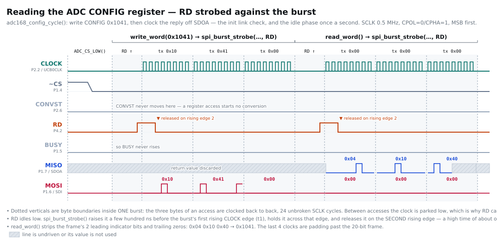

# Example outputs

What a healthy board actually produces on the wire. With no UART in the
firmware, the ADC bus *is* the output: everything below is what you should see
on a scope or logic analyzer.

- [Configuration readback timing](#configuration-readback-timing) — CLOCK, ~CS,
  CONVST, RD, BUSY, MISO and MOSI through the link check, one column per
  statement of C.
- [An acquisition burst](#an-acquisition-burst) — what one tick looks like, and
  how to turn the five readout bytes into two numbers.
- [Failure signatures](#failure-signatures) — what a broken link looks like.

## Configuration readback timing

This is the one register *read* the firmware performs: the link check in
[`adc168_init()`](src/adc168m102.c), which writes `CONFIG = 0x1041` (`R=01`
full update, `PDE=1`, action `A=0001` = "read CONFIG back") and then clocks the
reply frame off SDOA. It is the cheapest end-to-end proof that ~CS, RD, CLOCK,
SDI and SDOA are all wired and phased correctly, and its result is what the
firmware parks in `g_cfg` for the debugger.



*(Generated by [docs/img/config-read-timing.py](docs/img/config-read-timing.py);
run it from the repo root to regenerate.)*

### Reading the diagram

Each column is one statement of C, and the dotted verticals are the statement
boundaries. The nine columns are, in order, exactly the calls the firmware
makes:

```c
ADC_CS_LOW();                             /* ~CS low, and it stays low       */
write_word(0x1041)  ->  ADC_RD_PULSE();   /* falling edge opens the access   */
                        spi_xfer(0x10);   /* 8 gated SCLKs, command MSB      */
                        spi_xfer(0x41);   /* 8 gated SCLKs, command LSB      */
                        spi_xfer(0x00);   /* 8 gated SCLKs, activation edges */
read_word()         ->  ADC_RD_PULSE();
                        spi_xfer(0x00);   /* -> 0x04 */
                        spi_xfer(0x00);   /* -> 0x10 */
                        spi_xfer(0x00);   /* -> 0x40 */
```

Inside each `spi_xfer()` the CLOCK lane shows its 8 real cycles, and MOSI/MISO
show the actual bit levels for the byte named above them (MSB first). Between
bursts the clock is parked low — that gap is where the strobes move. At
`ADC_SCLK_DIV = 1` a cycle is 125 ns, so the 48 clocks are ~6 µs of bus time;
the gaps are CPU overhead, not specified delays.

| Signal | Pin | Behaviour during a register access |
|---|---|---|
| **CLOCK** | P2.2 / UCB0CLK | Gated: 8 cycles per `spi_xfer()`, 24 per access, idle low in between. |
| **~CS** | P1.4 | Driven low once in `adc168_init()` and held low for the whole session. |
| **CONVST** | P2.6 | Flat low. `ADC_CONVST_PULSE()` is never called on this path — it appears only in `adc168_read()`. |
| **RD** | P4.2 | Idles low. `ADC_RD_PULSE()` drives it high then low; the **falling** edge — the last thing before the first clock burst — opens the access. |
| **BUSY** | P1.5 | Flat low, since no conversion is running. |
| **MOSI** | P1.6 / SDI | `0x10 0x41 0x00` in `write_word()` — the first 16 clocks are the SDI latch window that takes the command word, the last 8 supply the rising edge that makes the register update active. Idle `0x00` during `read_word()`. |
| **MISO** | P1.7 / SDOA | Driven but discarded during `write_word()`. In `read_word()` it carries the 20-bit frame `[0][A/B ind][D15..D0][0 0]` plus 4 padding clocks — received as `0x04 0x10 0x40`. |

Bit surgery in `read_word()` drops the two leading indicator bits and the
trailing zeros, leaving `0x1041`. The check is on bits 11:4 of the readback:

```
0x1041 = 0001 0000 0100 0001
              ^^ ^^^^ ^^        bits 11:4 = 0x04
                                PD=00 FE=0 SR=0 FC=0 PDE=1 CID=0 CE=0
```

A mismatch (a dead MISO reads `0x0000` or `0xFFFF`) sets `ST_ADC_NOLINK`, which
lights the error LED before the first tick.

> A real acquisition uses the same vocabulary but moves the other two lines —
> that is the next section.

## An acquisition burst

This is what the firmware does 99.902 times a second, and the only place the
conversion results appear. Probe **SDOA** (EVM J5.1) for data and trigger on
**CONVST** (J5.13), rising edge, single shot — CONVST pulses once per tick with
~10 ms of quiet either side, so the capture lands on a whole acquisition every
time. Feed CLOCK (J5.7) to the analyzer as the bit clock; MISO is sampled on
the **falling** edge (CPOL=0/CPHA=1, MSB first).

```
CONVST _|‾|______________________________________________
CLOCK  ____24 conversion clocks____40 readout clocks_____
BUSY   ___|‾‾‾‾‾‾‾‾‾‾‾‾‾‾‾|______________________________
RD     _______________________|‾|________________________
SDOA   -------------------------[ frame A ][ frame B ]---
SDI    [0x40 0x00 0x00]----------[0x40 0x00 ...]---------
```

| Signal | Pin | Behaviour during one tick |
|---|---|---|
| **CONVST** | P2.6 → J5.13 | One ~190 ns pulse, while CLOCK is parked low. Rising edge freezes both sample-and-holds. |
| **BUSY** | P1.5 ← J5.5 | Rises with the conversion, falls after the ~18th CLOCK of the first burst. |
| **CLOCK** | P2.2 → J5.7 | Two gated bursts: 24 cycles to convert, then 40 to read out. Idle low in the gap, which is where RD moves. |
| **RD** | P4.2 → J5.11 | One pulse between the bursts; the **falling** edge starts frame A on SDOA. |
| **SDOA** | P1.7 ← J5.1 | Silent until RD falls, then 40 bits: frame A (CHA1) then frame B (CHB1). |
| **SDI** | P1.6 → J5.15 | `0x40 0x00` — the constant channel command (`C = 01`, `R = 00` "update C only"). Latched during the readout's first 16 clocks. |

At `ADC_SCLK_DIV = 1` a clock cycle is 125 ns, so the two bursts are 3 µs and
5 µs; the gaps between them are CPU overhead, not specified delays. The whole
burst is ~20 µs out of a 10.01 ms tick.

### Turning the readout into numbers

The 40 readout clocks are two 20-bit frames back to back:

```
   bit  39 38 | 37 ......... 22 | 21 20 | 19 18 | 17 .......... 2 | 1 0
        0  0  |  result A       | 0  0  | 0  1  |  result B       | 0 0
        ^  ^                             ^  ^
        |  +-- converter A indicator (0) |  +-- converter B indicator (1)
        +-- constant leading zero        +-- constant leading zero
```

Worked example — CHA1 at ≈ 1.26 V and CHB1 at ≈ 2.57 V come off the decoder as
these five bytes:

```
   b0   b1   b2   b3   b4
  0x30 0x25 0x84 0x0E 0x10
  00110000 00100101 10000100 00001110 00010000
```

```
   CHA1 = ((0x30 & 0x3F) << 10) | (0x25 << 2) | (0x84 >> 6) = 0xC096 = -16234
   CHB1 = ((0x84 & 0x03) << 14) | (0x0E << 6) | (0x10 >> 2) = 0x0384 =    900
```

Both are signed 16-bit two's complement: voltage ≈ 2.5 V + code × 76.3 µV, so
−16234 ≈ 1.261 V and 900 ≈ 2.569 V. (0 V ≈ −32768, 2.5 V ≈ 0, 5 V ≈ +32767.)

Check the six constant bits before trusting any of it — `b0 & 0xC0 == 0x00`,
`b2 & 0x3C == 0x04`, `b4 & 0x03 == 0x00`. Here that is `0x00`, `0x04`, `0x00`:
aligned. The firmware runs the same check on every frame and latches the error
LED when it fails.

### SPI loopback self-test

Built with `-DSPI_LOOPBACK_TEST=ON`, P1.6 jumpered to P1.7, ADC not required.
The ADC bus stays silent; the result is on the heartbeat LED alone:

| Blink rate | Meaning |
|---|---|
| Slow (~1 Hz) | PASS — 1000 bytes echoed back byte-for-byte |
| Fast (5x quicker), error LED on | FAIL — check the P1.6↔P1.7 jumper and the eUSCI setup |

## Failure signatures

| Symptom | Meaning | Where to look |
|---|---|---|
| Heartbeat LED dark, no bus traffic | The tick never runs — firmware stuck before `timer_init()`, or the timer never fires. | Halt with `mspdebug`, read `g_tick` and `g_status` |
| Error LED on from power-up, `g_status = 0x0001` | External 32 kHz never settled; the tick fell back to the DCO-derived 100 Hz. Bus traffic continues, timebase accuracy drops to ~±2 %. | LFXIN square wave at PJ.4 / crystal Y1 |
| Error LED on, `g_status = 0x0002`, `g_cfg = 0x0000` | Link check failed with SDOA stuck low — nothing is driving the line. | ~CS wiring, EVM DVDD, PHI controller board still fitted |
| Error LED on, `g_status = 0x0002`, `g_cfg = 0xFFFF` | Link check failed with SDOA stuck high. | SDOA wiring / pull-up, EVM power |
| Error LED on, `g_cfg = 0x1040`-ish | The link works but a mode bit came back wrong — usually the M0 strap. | J5.17 → GND strap (M1 stays pulled high) |
| SDOA frames fail the constant-bit check; `g_err_frame` climbing | Bit alignment is off: clock phase, strobe timing, or long jumper wires at 8 MHz. | Lower `ADC_SCLK_DIV` in [src/board.h](src/board.h) to 2 (4 MHz) or 4 (2 MHz) |
| BUSY never falls; `g_err_busy` climbing | Conversion not completing, or BUSY not wired. | J5.5 → P1.5, EVM AVDD, CONVST reaching J5.13 |
