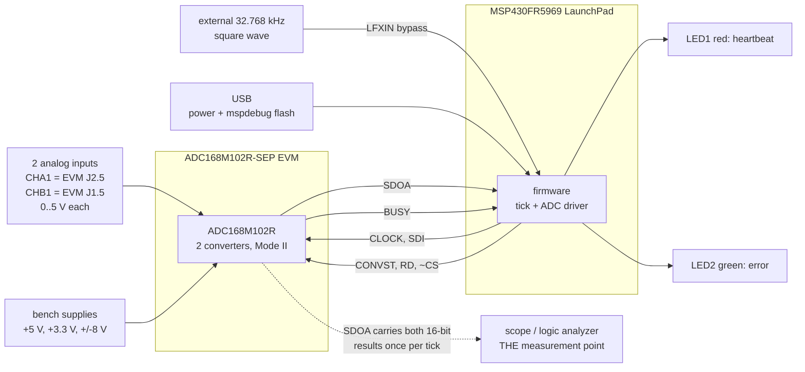
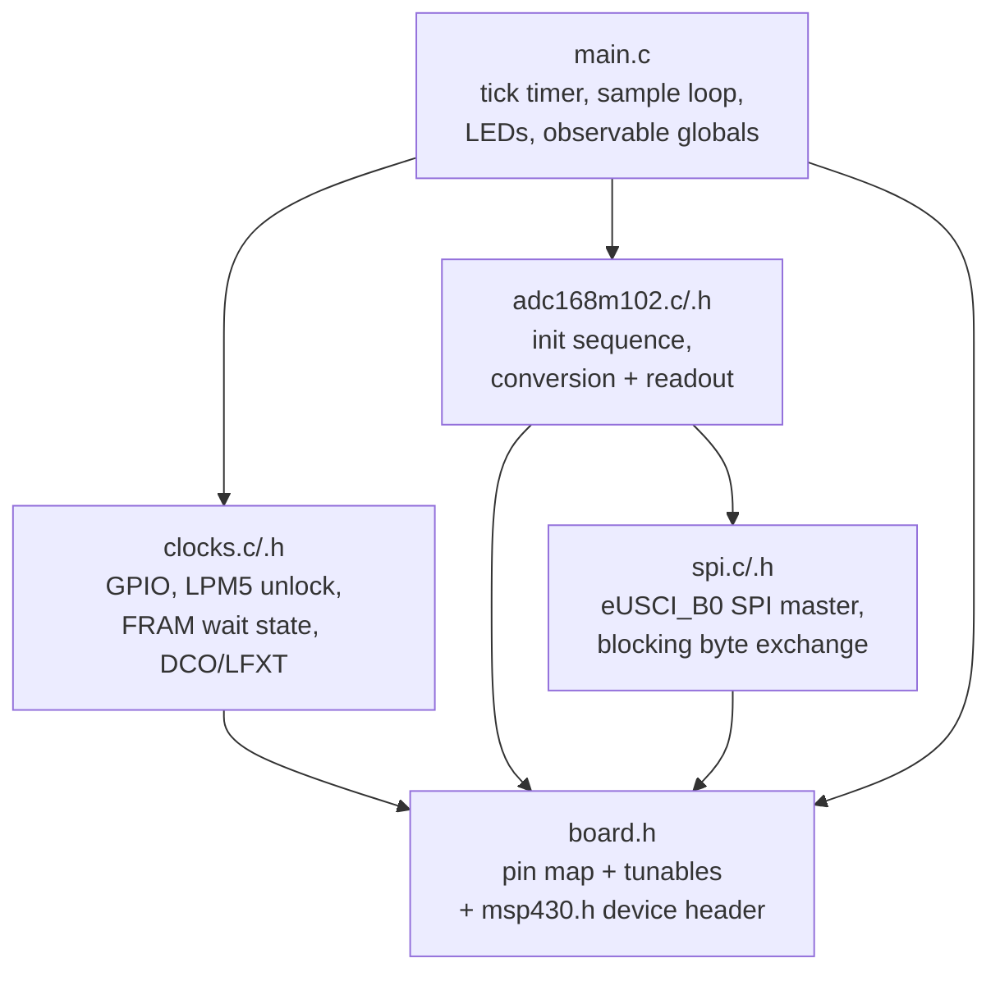
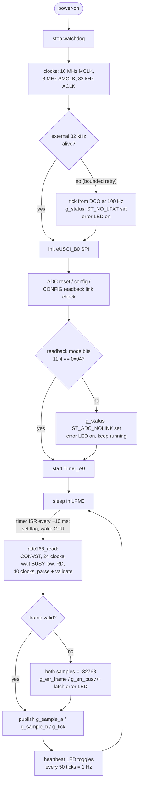
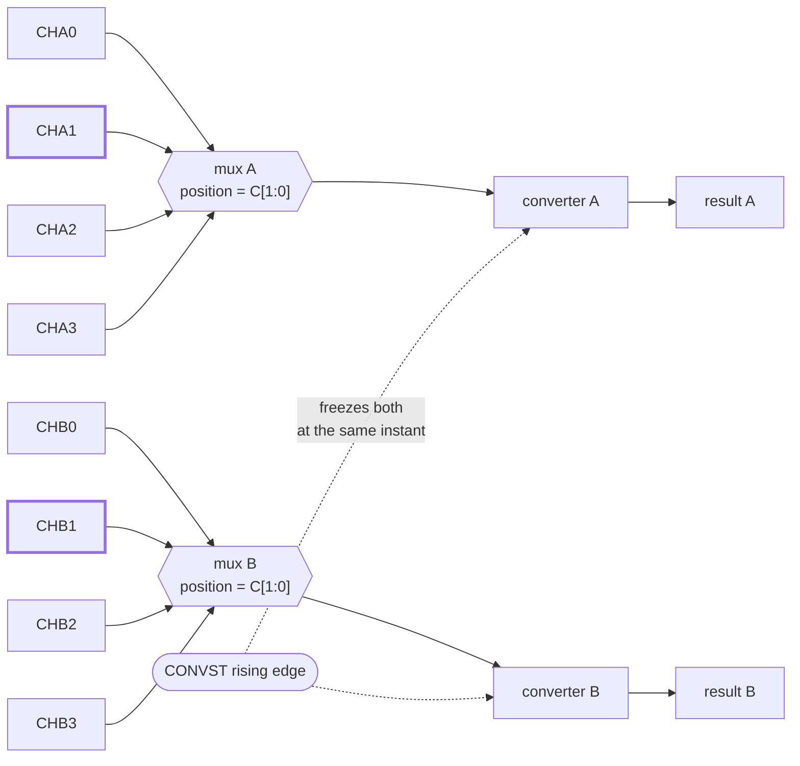
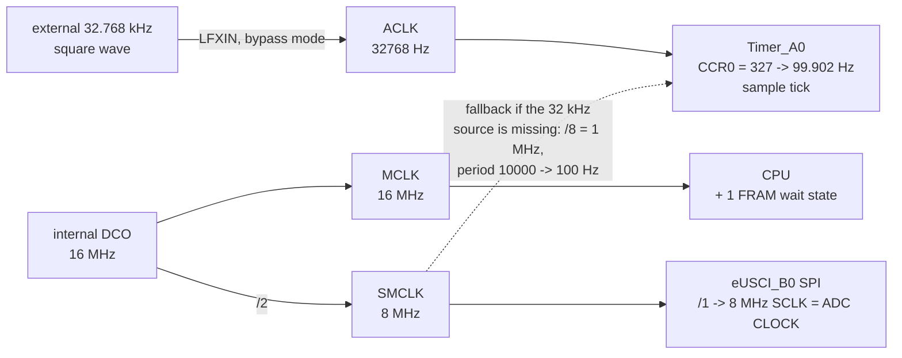
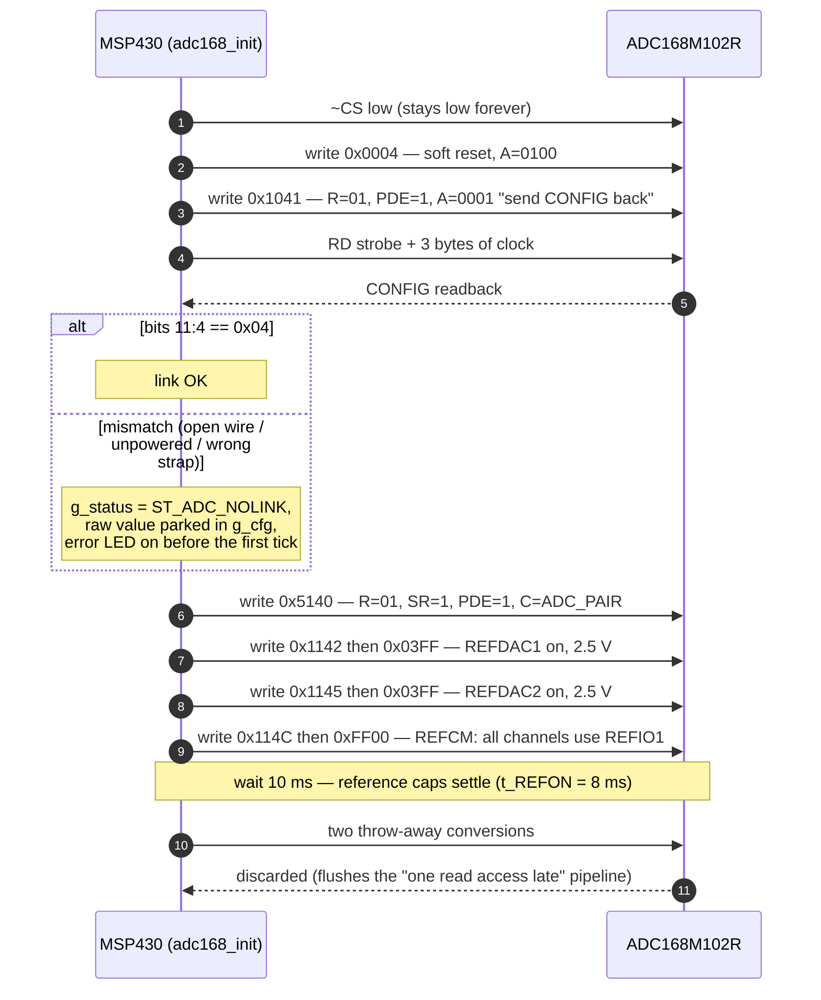
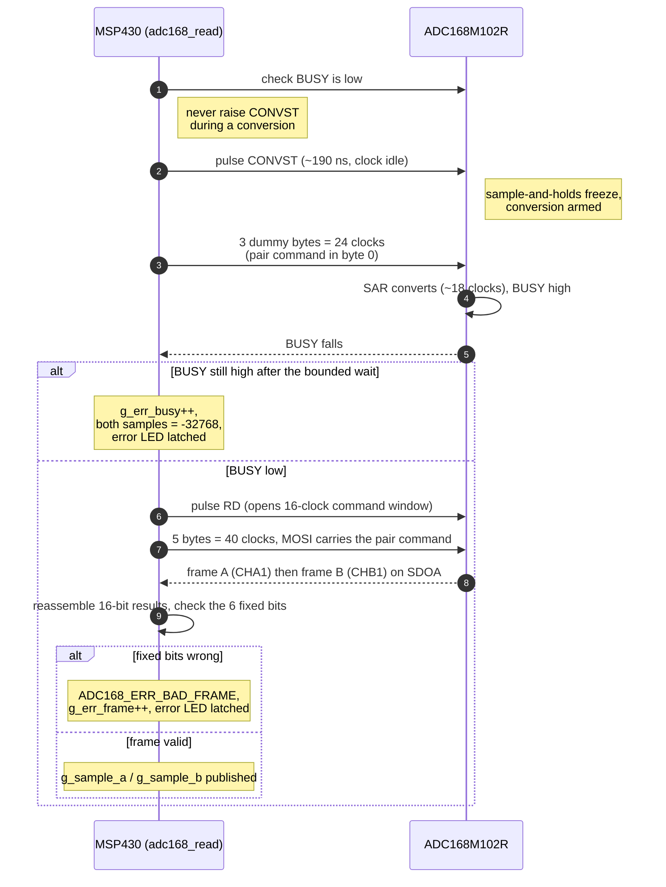
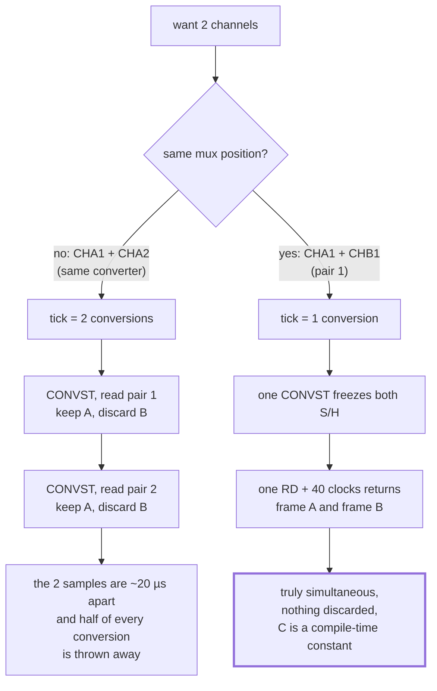
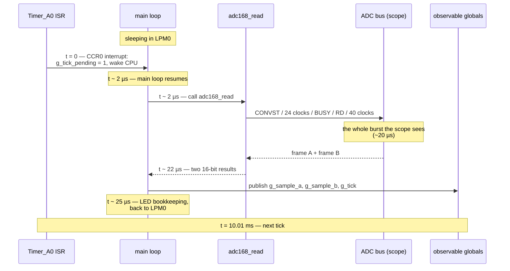
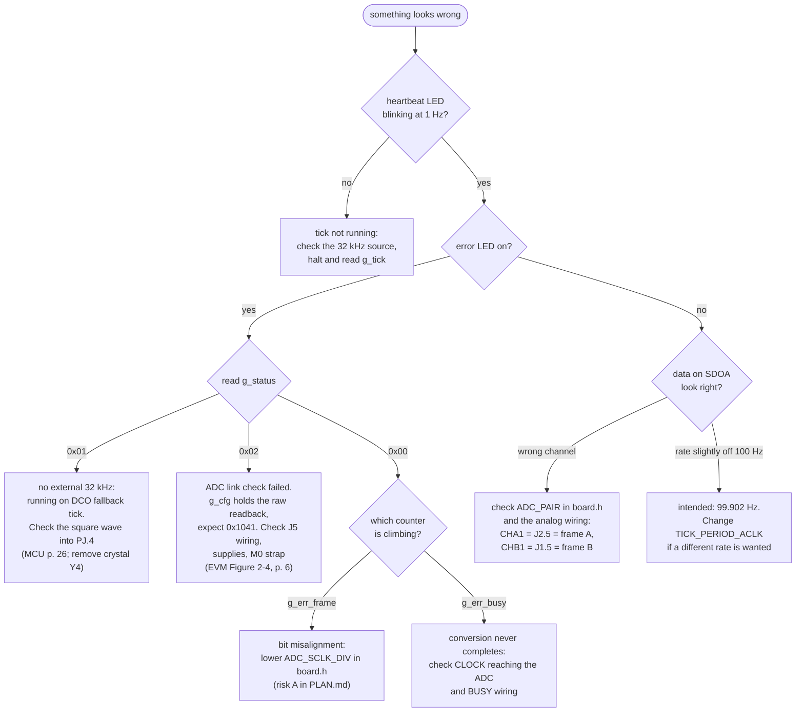

# Design

The complete "what, why and how" of the firmware, in one document: a summary
of the system and its decisions first, then the background needed to follow
them, then the implementation in detail, then how to observe and diagnose the
running system.

Read **Part I** alone if you only want the overview. Read **Part II** if you
have never worked with an ADC or SPI before — everything after it assumes
those ideas. For the phased build plan and risk register, see
[PLAN.md](PLAN.md).

## Reference documents

Every non-obvious claim below is cited back to the primary source. Citations
use these short keys and give the **PDF page number**, which for all four
documents equals the printed page number:

| Key | Document | TI literature number | In this repo |
|---|---|---|---|
| **ADC** | ADC168M102R-SEP data sheet | SBASAW9, December 2024 | [`ADC168M102R-SEP datasheet - sbasaw9.pdf`](<ADC168M102R-SEP datasheet - sbasaw9.pdf>) |
| **MCU** | MSP430FR596x, MSP430FR594x mixed-signal microcontrollers data sheet | SLAS704G, Oct 2012 – rev. Aug 2018 | [`MSP430FR596x... datasheet (Rev. G) - msp430fr5969.pdf`](<MSP430FR596x, MSP430FR594x Mixed-Signal Microcontrollers datasheet (Rev. G) - msp430fr5969.pdf>) |
| **EVM** | ADC168M102REVM-PDK evaluation module user's guide | SBAU478, February 2025 | [`ADC168M102REVM-PDK ... - sbau478.pdf`](<ADC168M102REVM-PDK Evaluation Module User's Guide - sbau478.pdf>) |
| **LP** | MSP430FR5969 LaunchPad development kit (MSP-EXP430FR5969) user's guide | SLAU535B, Feb 2014 – rev. Jul 2015 | [`MSP430FR5969 LaunchPad ... (Rev. B) - slau535b.pdf`](<MSP430FR5969 LaunchPad Development Kit (MSP-EXP430FR5969) User's Guide (Rev. B) - slau535b.pdf>) |

So *(ADC §6.3.1.4, p. 19)* means section 6.3.1.4 on page 19 of SBASAW9.
[Section 18](#18-datasheet-cross-reference-index) collects every citation into
one index, grouped by document.

Note that **register-level MSP430 programming detail is not in the MCU data
sheet** — bits such as `UCB0CTLW0`, `CSCTL4`, `FRCTL0` and `LOCKLPM5` are
specified in the *MSP430FR58xx/59xx family user's guide* (SLAU367), which is
not bundled here. The MCU data sheet is cited for pin functions, electrical
limits and clock/interface timing; the code comments in [`src/`](../src/) name
the registers.

Contents:

**Part I — Overview**
1. [What the system does](#1-what-the-system-does)
2. [Key design decisions](#2-key-design-decisions)
3. [Software structure](#3-software-structure)
4. [Runtime behaviour](#4-runtime-behaviour)

**Part II — Background from first principles**

5. [What an ADC is](#5-what-an-adc-is)
6. [What SPI is](#6-what-spi-is)
7. [Why this ADC is not a "normal" SPI device](#7-why-this-adc-is-not-a-normal-spi-device)
8. [The trick that makes SPI work anyway: the gated clock](#8-the-trick-that-makes-spi-work-anyway-the-gated-clock)

**Part III — The implementation**

9. [The MSP430 side: clocks, pins, peripherals](#9-the-msp430-side-clocks-pins-peripherals)
10. [Talking to the ADC, step by step](#10-talking-to-the-adc-step-by-step)
11. [Reading two channels: why a pair](#11-reading-two-channels-why-a-pair)
12. [Timing: the 100 Hz tick](#12-timing-the-100-hz-tick)
13. [Putting it together: one tick, start to finish](#13-putting-it-together-one-tick-start-to-finish)

**Part IV — Observing and diagnosing**

14. [Getting at the data: the scope](#14-getting-at-the-data-the-scope)
15. [Number formats: decoding a readout burst by hand](#15-number-formats-decoding-a-readout-burst-by-hand)
16. [What can go wrong and how the firmware reacts](#16-what-can-go-wrong-and-how-the-firmware-reacts)
17. [Glossary](#17-glossary)
18. [Datasheet cross-reference index](#18-datasheet-cross-reference-index)

---

# Part I — Overview

## 1. What the system does

An MSP430FR5969 microcontroller (on a TI LaunchPad board) drives an external
precision ADC (TI ADC168M102R-SEP on its evaluation board) to sample two
analog voltages roughly 100 times per second.

The two inputs are **CHA1** (EVM header J2.5) and **CHB1** (J1.5). They sit
on the ADC's two independent converters at the same mux position, so one
conversion digitizes both *at the same instant* and one readout returns
both. Which pair is acquired is the `ADC_PAIR` constant in `board.h`.

**There is no output path off the MCU.** The results are read directly off
the ADC bus with a scope or logic analyzer — SDOA carries both 16-bit results
during the 40-clock readout burst that follows every tick. The firmware's only
job is to run that bus traffic reliably at 99.902 Hz and to flag trouble on
two LEDs.



## 2. Key design decisions

| Decision | Choice | Why |
|---|---|---|
| ADC interface | eUSCI_B0 SPI at 8 MHz for CLOCK/SDI/SDOA + three GPIO strobes | The ADC's clock doubles as its conversion clock and the datasheet permits a gated ("burst") clock — which is exactly what an SPI master produces ([§8](#8-the-trick-that-makes-spi-work-anyway-the-gated-clock)). Half-clock mode accepts 0.5–20 MHz *(ADC §6.3.1.4, p. 19)*; 8 MHz is the closest DCO-derivable rate at or below the requested 10 MHz, and is inside the eUSCI's own SPI-master limits *(MCU Tables 5-18/5-19, pp. 38–39)*. |
| ADC operating mode | Mode II (M0 strapped low), special-read (SR=1), pseudo-differential (PDE=1) | Mode II = M0 0, M1 1: manual channel select, SDOA only *(ADC Table 6-5, p. 21)*. With SR=1 one RD strobe + 40 clocks returns both converters' results *(ADC §6.5.2.3, p. 27)* — exactly the two channels wanted — so a tick is a single conversion. The internal 2.5 V reference is routed as common mode by software, so the EVM needs no jumper changes. |
| Input mux | Pseudo-differential **4:1** configuration (`PDE=1`, ADC Table 6-2, p. 17), channel picked by CONFIG `C[1:0]` | Gives four single-ended inputs per converter measured against a common mode, which is what this application wants. `M0 = 0` keeps selection *manual* through `C[1:0]`; the SEQFIFO sequencer applies only to automatic mode (`M0 = 1`) *(ADC §6.3.2.1, p. 21)* and is left at its reset default. |
| Channel selection | Fixed pair, `ADC_PAIR = 1` → `C = 01` → CHA1 + CHB1, set in the init CONFIG word and re-asserted on every access | Picking two channels that share a mux position makes them simultaneous by construction and removes the pipelined channel-rotation entirely ([§11](#11-reading-two-channels-why-a-pair)): the C field is a constant, so a corrupted command can only mis-select for one sample before the next access corrects it. |
| Sample timebase | External 32.768 kHz square wave into LFXIN (bypass) → Timer_A0, period 328 → 99.902 Hz | User requirement (external low-frequency source). LFXT bypass accepts a 10.5–50 kHz digital square wave at 30–70 % duty *(MCU p. 26)*. 100.000 Hz is not an integer division of 32768; 328 is the closest. |
| Fallback | If the 32 kHz source is missing: internal DCO timer at exactly 100 Hz, status flag set | Never hang; make the degraded state visible on the error LED and in `g_status`. |
| Readout | None from the MCU — the ADC bus itself is the measurement point | The scope has to be on the bus during bring-up anyway, and SDOA already carries both results in full 16-bit resolution. Dropping the UART removes a peripheral, an ISR, a 256-byte buffer and a whole class of "did the host keep up?" failure from the tick path. |
| Status reporting | Two LEDs, plus every computed value held in a `volatile` global for the debugger | Enough to tell "alive and ticking" from "something is wrong" at a glance; `mspdebug` supplies the detail when the LED says to look. |
| Integrity | Every ADC frame carries fixed indicator/zero bits which are checked on every read *(ADC Figure 6-7, p. 27)* | Cheap, continuous self-test of wiring and clock phase; failures are counted in the `errs` column and light the error LED. |
| Toolchain | TI msp430-gcc via CMake cross file; Docker/Podman dev image | Reproducible builds on any host; no IDE dependency. |

## 3. Software structure

```
src/
├── board.h        pin map, tunables (channel pair, SCLK divider, tick
│                 period), pin macros
├── clocks.c/.h    GPIO setup, LPM5 unlock, FRAM wait state, DCO/LFXT clocks
├── spi.c/.h       eUSCI_B0 SPI master, blocking byte exchange
├── adc168m102.c/.h ADC driver: init sequence, conversion + readout
└── main.c         tick timer, sample loop, LEDs, observable globals
```

Layering (arrows = "uses"):



## 4. Runtime behaviour



The scope sees one ~20 µs burst per tick, 10 ms apart.

Per-tick budget: ~20 µs on the ADC bus plus a few µs of bookkeeping, then the
CPU sleeps. CPU utilisation is well under 1 %.

---

# Part II — Background from first principles

## 5. What an ADC is

An **analog-to-digital converter** measures a voltage and produces a number.
Ours is 16-bit: the number ranges over 65 536 distinct values, so across a
5 V span each step (one "LSB", least significant bit) is 5 V / 65 536 ≈
76 µV. The code is binary two's complement *(ADC Table 6-7, p. 24)*.

Three ideas matter for this design:

**Sample-and-hold.** The input voltage is constantly changing. The ADC
first *tracks* the input, then on a command ("CONVST", conversion start) it
*freezes* a snapshot on an internal capacitor. The conversion then works on
that frozen value, so the reading corresponds to one precise instant.

**Conversion takes time and needs a clock.** This ADC is a *SAR*
(successive approximation) converter — it homes in on the answer one bit
per clock cycle, like a binary search. In this part's default *half-clock
mode* a complete conversion cycle including acquisition needs at least
20 CLOCKs *(ADC §6.3.2.2, p. 21)*; the SAR itself finishes in roughly 18 of
them. Crucially, *the ADC has no clock of its own*: it uses whatever we send
on its CLOCK pin, both for converting and for shifting the result out
*(ADC §6.3.1.4, p. 19)*.

**Reference voltage.** The ADC measures the input *relative to* a reference
voltage (V_REF). Full scale = ±V_REF. Ours has two built-in reference DACs
that we enable and program in software *(ADC §6.5.3, p. 31; Table 6-3, p. 19)*;
we set both to 2.5 V.

### This particular ADC: two converters, eight channels

The ADC168M102R-SEP contains **two** independent 16-bit converters, "A" and
"B", that snapshot at exactly the same instant *(ADC §6.2 functional block
diagram, p. 16)*. In front of each sits a 4-way switch (multiplexer, "mux"):



We tell it which mux position to use (0, 1, 2 or 3), and one conversion
then delivers **channel pair k = (CHAk, CHBk)**.

This firmware needs only **two** channels, and it picks them from the same
mux position: **CHA1 and CHB1** (pair 1). That choice is what makes the
whole acquisition a single conversion per tick — see
[section 11](#11-reading-two-channels-why-a-pair).

### Pseudo-differential inputs and common mode

Each converter actually measures a *difference* between a positive and a
negative input. The mux in front of it can be wired up two ways, and we
choose the second:

| `PDE` | Configuration | Inputs per converter |
|---|---|---|
| 0 | Fully differential 2:1 *(ADC Table 6-1, p. 17)* | 2 pairs, each measured against its own negative pin |
| **1** | **Pseudo-differential 4:1** *(ADC Table 6-2, p. 17)* | **4 single-ended inputs, all measured against a shared common mode** |

In the **pseudo-differential 4:1** configuration the negative input is a
fixed voltage called the **common mode**, and the four CHxx pins per
converter are the positive inputs — eight in total. The same `C[1:0]` bits
that would pick one of two differential pairs now pick one of four
single-ended inputs:

```
  C[1:0]   ADC+     ADC-
    00     CHx0     CMx / REFIOx
    01     CHx1     CMx / REFIOx     <- what this firmware uses
    10     CHx2     CMx / REFIOx
    11     CHx3     CMx / REFIOx
```

We route the internal 2.5 V reference to be that common mode. Consequence: each channel measures its input relative
to 2.5 V, giving a ±2.5 V range around 2.5 V — i.e. 0 V to 5 V
*(ADC Table 6-7, p. 24)*:

| Input voltage | Output code (two's complement) |
|---|---|
| 5.0 V | +32767 (0x7FFF) |
| 2.5 V | 0 (0x0000) |
| 0.0 V | −32768 (0x8000) |

---

## 6. What SPI is

**SPI** (Serial Peripheral Interface) is a simple way for two chips to
exchange bytes over a few wires. One side is the **master** (it generates
the clock — the MSP430 here), the other is the **slave** (the ADC).

Wires:

| Name (generic) | Name on MSP430 | Name on ADC | Direction | Purpose |
|---|---|---|---|---|
| SCLK | UCB0CLK | CLOCK | master → slave | Clock: one pulse per bit |
| MOSI | UCB0SIMO | SDI | master → slave | Data *to* the slave |
| MISO | UCB0SOMI | SDOA | slave → master | Data *from* the slave |
| ~CS | (GPIO P1.4) | ~CS | master → slave | "Chip select": low = you are being talked to |

MSP430 signal names are from *(MCU Table 4-1, pp. 12–15)*; ADC signal names
from *(ADC Table 4-1, pp. 3–4)*.

How a byte moves: the master toggles SCLK eight times. On each pulse, one
bit goes out on MOSI *and* one bit comes back on MISO — SPI is always
full-duplex, even if one direction is carrying junk. Which clock *edge*
(rising or falling) each side uses to change and to read data is fixed by
two settings called **CPOL** (idle level of the clock) and **CPHA**
(which edge samples). Get them wrong and you read every bit one slot late —
garbage. For our ADC:

- The ADC **changes** its output bit on the **rising** edge, so we must
  **read** it on the **falling** edge.
- The ADC **reads** our input bit on the **falling** edge, so we must
  **change** it on the **rising** edge.
- The clock **idles low**.

*(ADC §6.3.2.2, p. 21 — "the first output bit is available with the falling RD
edge, and the following output data bits are refreshed with the CLOCK rising
edge"; waveforms in ADC Figure 5-1, p. 10.)*

That combination is CPOL = 0, CPHA = 1. In TI's eUSCI register naming that
is `UCCKPL = 0` and `UCCKPH = 0` (TI's phase bit is the inverse of the
Motorola convention — a classic trap, called out in `spi.c`).

```
 SCLK  ___|‾‾|__|‾‾|__|‾‾|__|‾‾|__ ...
             ^      ^                  MSP430 samples MISO on falling edges
          ^      ^                     ADC drives MISO on rising edges
 MISO  ---< b7 >< b6 >< b5 >< b4 > ...   (MSB first)
```

An 8 MHz clock means each bit takes 125 ns, a byte 1 µs. Both ends have
margin at that rate: the ADC allows 0.5–20 MHz in half-clock mode
*(ADC §6.3.1.4, p. 19)*, and the eUSCI's SPI-master setup/valid times are
specified in *(MCU Table 5-19, p. 39)*.

---

## 7. Why this ADC is not a "normal" SPI device

A typical SPI sensor has a tidy protocol: pull ~CS low, send a command
byte, read back some bytes, release ~CS. This ADC is different in three
ways, and the whole driver design follows from them:

1. **CLOCK is also the conversion clock.** The SAR needs ~18 clock pulses
   to finish converting. Those pulses come from *our* SCLK. So we must send
   clocks even when we have nothing to say, just to make the conversion
   progress. *(ADC §6.3.1.4, p. 19; §6.3.2.2, p. 21.)*

2. **Two extra control strobes.** Besides ~CS there are:
   - **CONVST** — a rising edge freezes the sample-and-holds and arms a
     conversion, which starts on the *next* CLOCK rising edge (setup time
     12 ns minimum) *(ADC §6.3.1.1, p. 18)*.
   - **RD** — a falling edge tells the ADC "start shifting your result out
     on SDOA now", and it *also* opens a 16-clock window in which the ADC
     listens on SDI for a command word *(ADC §6.5.1, p. 24)*.
   These are ordinary GPIO pins on the MSP430 that we pulse under software
   control.

3. **A status output.** **BUSY** goes high while the inputs are in hold mode
   and returns low when the conversion completes *(ADC Table 4-1, p. 3)*.
   We must not raise CONVST while it is high *(ADC §6.3.1.1, p. 18)*.

So the ADC has seven wires to us: CLOCK, SDI, SDOA, ~CS, CONVST, RD, BUSY —
all in *(ADC Table 4-1, pp. 3–4)*.

---

## 8. The trick that makes SPI work anyway: the gated clock

Because SCLK is also the conversion clock, one might think we need a
free-running clock signal. We do not. The datasheet says that "when using the
device in burst mode, keep the clock held static low or high when read access
completes and before starting a new conversion" *(ADC §6.3.1.4, p. 19)*. And that
is *exactly* what an SPI master naturally does: the clock only toggles
while a byte is being transferred and sits at its idle level (low, for
CPOL = 0) otherwise.

So the design is:

- **Need N clock pulses?** Transfer N/8 bytes. The bytes' contents may or
  may not matter, but the *pulses* always do.
- **Between bursts** the clock is idle-low, and it is in these quiet gaps
  that we pulse CONVST and RD from GPIO. That guarantees a strobe never
  coincides with a clock edge — which is what the datasheet's "make sure the
  RD signal in this mode is not longer than one clock cycle" rule
  *(ADC §6.5.2.3, p. 27)* is really protecting against.

There are two subtle consequences the driver handles explicitly:

- "All register updates become active with the CLOCK rising edge after
  completing the 16-clock-cycle write access" *(ADC §7, p. 32)*. With a gated
  clock, that edge would not arrive until our next transfer. So every register
  write sends **a third, dummy byte** purely to supply that edge (see
  `write_word()`).
- "Changes to the FE, SR, PDE, and CID register bits are active starting from
  the next conversion with a delay of one read access" *(ADC §6.5.2.2, p. 26)*.
  After configuring, the driver performs **two throw-away conversions** so the
  streaming loop only ever sees settled framing (see the end of
  `adc168_init()`).

---

# Part III — The implementation

## 9. The MSP430 side: clocks, pins, peripherals

### 9.1 The MSP430FR5969 in one paragraph

A 16-bit microcontroller with 64 KB of FRAM (non-volatile memory that is
also writable like RAM), 2 KB SRAM, and a set of on-chip peripherals. The
ones we use: **eUSCI_B0** (configured as SPI), **Timer_A0** (for the 100 Hz
tick), and the **clock system** that generates the CPU and peripheral
clocks. That is deliberately the whole list — there is no serial peripheral
in this firmware. *(MCU device comparison, p. 5: eUSCI_B0 supports I²C and
SPI; TA0 is the 3-CCR Timer_A instance.)*

### 9.2 Clock tree



- **DCO** = digitally-controlled oscillator, the chip's internal RC clock.
  Its selectable ranges and tolerances are in *(MCU p. 29)*; 16 MHz is one of
  the calibrated settings. 16 MHz for the CPU means FRAM needs one *wait
  state* — the zero-wait-state limit is 8 MHz *(MCU pp. 17–18,
  `NWAITSx = 0` vs `= 1`)* — which is why `clocks.c` writes `FRCTL0` before
  raising the clock.
- **SMCLK at 8 MHz** is what the SPI divides down from: ÷1 → 8 MHz SCLK,
  which is the ADC's CLOCK. The eUSCI's own SPI-master clock ceiling is in
  *(MCU Table 5-18, p. 38)*.
- **ACLK from LFXIN in bypass mode.** "Bypass" means "there is no crystal,
  an external logic-level clock is being fed in" — the user's 32.768 kHz
  square wave. With `LFXTBYPASS = 1` the LFXT oscillator circuit is powered
  down and the pin accepts a digital square wave of 10.5–50 kHz at 30–70 %
  duty cycle *(MCU p. 26)*, so 32.768 kHz sits comfortably in range. If the
  source is missing, an oscillator-fault flag stays latched; the firmware
  retries a bounded number of times and then falls back to a DCO-based tick,
  flagging the condition (`ST_NO_LFXT`) rather than hanging.

### 9.3 Pin map

J5 pin numbers are from the EVM's probe/controller header *(EVM Figure 2-4,
p. 6)*; the "pin function" column names the MCU data sheet table that lists
each pin's `PxSEL1`/`PxSEL0` encodings.

| MSP430 pin | Function | Wire to ADC (EVM J5 pin) | Pin functions (MCU) |
|---|---|---|---|
| P2.2 | eUSCI_B0 clock (SCLK) | CLOCK (7) | Table 6-52, p. 90 |
| P1.6 | eUSCI_B0 SIMO (MOSI) | SDI (15) | Table 6-51, p. 89 |
| P1.7 | eUSCI_B0 SOMI (MISO) | SDOA (1) | Table 6-51, p. 89 |
| P1.4 | GPIO output | ~CS (9) — held low | Table 6-50, p. 88 |
| P2.6 | GPIO output | CONVST (13) | Table 6-54, p. 94 |
| P4.2 | GPIO output | RD (11) | Table 6-58, p. 101 |
| P1.5 | GPIO input, pulldown | BUSY (5) | Table 6-50, p. 88 |
| PJ.4 | LFXIN | external 32.768 kHz | Table 6-60, p. 106 |
| P1.0 / P4.6 | GPIO | LEDs (heartbeat / error) | Tables 6-49, p. 86 / 6-59, p. 103 |

The two analog inputs are not MSP430 pins at all — they go straight into
the EVM's op-amp buffers on its own headers *(EVM §2.2 and Figure 2-3, p. 5)*:

| ADC channel | EVM header pin | Buffer | On SDOA |
|---|---|---|---|
| CHA1 | J2 pin 5 (even pins GND) | OPA4H014-SEP U2C | frame A |
| CHB1 | J1 pin 5 (even pins GND) | OPA4H014-SEP U1C | frame B |

Those buffers need the ±8 V supplies on J3/J4 — the EVM specifies
6 V ≤ OPA_V+ ≤ 10 V and −10 V ≤ OPA_V− ≤ 0.35 V on J3[3]/J4[3] and
J3[1]/J4[1] *(EVM Table 1-1, p. 3)*. The other six channel inputs are left
open.

MSP430 pins are multi-function; two "select" bits per pin decide whether
the pin is plain GPIO or belongs to a peripheral. `clocks.c` sets those
(`PxSEL1`/`PxSEL0`) for the SPI and LFXIN pins. FRAM-family parts
also keep all pins in high-impedance after reset until a lock bit
(`LOCKLPM5`) is cleared: "after a BOR reset, the ports must be configured
first and then the `LOCKLPM5` bit must be cleared" *(MCU p. 63)* — done right
after pin configuration.

The ADC's mode pin **M0 is strapped to ground on the EVM header** (J5.17,
*EVM Figure 2-4, p. 6*). Together with M1 (pulled high on the EVM) this puts
the ADC in "Mode II": manual channel selection through SDI, data on SDOA only
*(ADC Table 6-5, p. 21)*.

---

## 10. Talking to the ADC, step by step

### 10.1 The command word

Every 16-bit word we send to the ADC (during the 16-clock window after an
RD strobe) is a **CONFIG register write** *(ADC Figure 7-2 and Table 7-2,
pp. 33–35)*. Its fields, MSB first:

```
 bit 15 14 | 13 12 | 11 10 | 9  | 8  | 7  | 6   | 5   | 4  | 3 2 1 0
     C[1:0]| R[1:0]| PD    | FE | SR | FC | PDE | CID | CE | A[3:0]
```

The ones we use:

| Field | Meaning | Our value |
|---|---|---|
| C | which channel pair to convert **next** | `ADC_PAIR` (01) — a compile-time constant, re-sent on every access |
| R | 00 = "only update C"; 01 = "rewrite the whole register" | 01 at init, 00 in the per-conversion command |
| SR | special read: one RD delivers *both* converters' results | 1 |
| PDE | pseudo-differential (8 single inputs vs common mode) | 1 |
| CID | 1 = omit the indicator bits from frames | 0 (we want them for checking) |
| A | an *action*: 0000 nothing, 0001 "read CONFIG back", 0100 software reset, x010/x101 "the next word goes to reference DAC 1/2", 1100 "the next word goes to REFCM" | varies |

The A-field encodings are listed in *(ADC Table 7-2, p. 34)*. The pattern for
the "next word goes to register X" actions is a two-step write: first the
CONFIG word carrying the address, then the value — illustrated in
*(ADC Figure 7-1, p. 32)*.

### 10.2 The initialization sequence (`adc168_init()`)

```
 1. ~CS low                       enable the interface, stays low forever
 2. write 0x0004                  soft reset (A=0100): everything to defaults
 3. write 0x1041                  R=01, PDE=1, A=0001 -> "send CONFIG back"
 4. RD + read 3 bytes             the readback arrives; check bits 11:4 == 0x04
                                  (PDE=1, all else 0). Wrong -> ST_ADC_NOLINK.
 5. write 0x5140                  R=01, SR=1, PDE=1, CID=0, C=01 (real config;
                                  C = ADC_PAIR, so conversion 1 is pair 1)
 6. write 0x1142 then 0x03FF      REFDAC1 <- enable, 2.5 V
 7. write 0x1145 then 0x03FF      REFDAC2 <- enable, 2.5 V
 8. write 0x114C then 0xFF00      REFCM   <- all channels use REFIO1 as common mode
 9. wait 10 ms                    reference capacitors settle (t_REFON = 8 ms)
10. two throw-away conversions    flush the "one read access late" pipeline
```

Sources for each step: soft reset *(ADC §6.4.1.4, p. 23; A = 0100 in
Table 7-2, p. 34)*; CONFIG readback action *(ADC Table 7-2, p. 34)*; the
operating word's SR/PDE/CID/C fields *(ADC Table 7-2, pp. 33–34)*; the REFDAC
registers and their 2.5 V code *(ADC Figures 7-4/7-5 and Tables 7-3/7-4, p. 36;
setting examples in Table 6-3, p. 19)*; REFCM *(ADC Figure 7-9 and Table 7-7,
pp. 40–41)*; t_REFON = 8 ms max with C_REF = 22 µF *(ADC §5.7, p. 10)*, and the
EVM does fit 22 µF on REFIO1/REFIO2 *(EVM §2.3, p. 6)*; the two-conversion
flush *(ADC §6.5.2.2, p. 26)*.

As a conversation between the two chips:



Step 4 is the **link check**: if MISO is dead (open wire, ADC unpowered,
wrong strap) we read all-zeros or all-ones and the mode bits will not
match — the firmware then sets `ST_ADC_NOLINK`, lights the error LED before
the first tick, and parks the raw value in `g_cfg` for the debugger. Note
that `g_cfg` is the *link-check* readback (expected `0x1041`), captured at
step 4 — before the operating word of step 5 is written, so it does not
carry the channel selection.

Steps 6–8 matter because the internal references are **off by default** —
REFDAC1/REFDAC2 reset to `0x07FF`, which has the power-down bit set
*(ADC Figures 7-4/7-5, p. 36)* — so without them the ADC would convert against
nothing. Step 8 is what makes the pseudo-differential 4:1 configuration usable:
the `CMxx` bits choose the *internal* reference over the external CMA/CMB pins,
and the `Rxx` bits choose REFIO1 (the 2.5 V DAC from step 6) over REFIO2
*(ADC Table 7-7, pp. 40–41; block diagram in §6.3.1, p. 20)*. Writing `0xFF00`
arms all eight channels even though only two are read — it costs one word and
keeps `ADC_PAIR` a one-line change. Doing it in firmware is also why the EVM's
JP1/JP2 jumpers can stay in their default `CMx_EXT` position *(EVM §2.2, p. 5)*.

> **A datasheet trap.** §6.3.1.1 *(ADC p. 17)* says "In pseudo-differential
> mode, channel selection is performed with the SEQFIFO register." That
> sentence is about *automatic* channel selection, which is `M0 = 1`: §6.3.2.1
> *(ADC p. 21)* puts "for pseudo-differential inputs, the internal sequencer
> controls the input multiplexer" inside its automatic-mode paragraph, and
> Table 6-5 on the same page defines `M0 = 0` as manual selection through SDI.
> We strap `M0 = 0`, so `C[1:0]` steers the mux, per Table 6-2 *(ADC p. 17)*.
> SEQFIFO is never written; its reset value has `SL = 00`, whose own
> description reads "Do not use; use mode I or II instead, where M0 is 0"
> *(ADC Table 7-6, p. 37)*. Leaving it alone also satisfies REFCM's "set this
> register before setting the REFCM register" ordering note *(ADC p. 37,
> footnote to Table 7-6)* for free.

### 10.3 One conversion + readout (`adc168_read()`)

```
   CONVST  _|‾|________________________________________________
   CLOCK   ____xxxxxxxxxxxxxxxxxxxxxxxx____xxxxxxxxxx...xxxx____
               ^ 24 conversion clocks       ^ 40 readout clocks
   BUSY    ___|‾‾‾‾‾‾‾‾‾‾‾‾‾‾‾|______________________________
   RD      _______________________________|‾|__________________
   SDOA    ---------------------------------[frame A ][frame B ]
   SDI     [pair cmd]----------------------------[pair cmd]---
```

1. **Check BUSY is low.** "Do not issue a rising CONVST edge during a
   conversion (that is, when BUSY is high)" *(ADC §6.3.1.1, p. 18)*.
2. **Pulse CONVST** (two GPIO writes, ~190 ns, clock is idle).
   Sample-and-holds freeze; the conversion starts on the next CLOCK rising
   edge, for which CONVST needs 12 ns of setup *(ADC §6.3.1.1, p. 18)*.
3. **Send 3 dummy bytes = 24 clocks.** Half-clock mode needs at least 20
   CLOCKs for a complete conversion cycle *(ADC §6.3.2.2, p. 21)*; 24 leaves
   margin. (We put the channel command in the first byte too — harmless if
   ignored, correct if latched.)
4. **Wait for BUSY low** with a bounded loop — BUSY returns low when the
   conversion completes *(ADC Table 4-1, p. 3)*. It drops during the burst;
   the wait is a safety net that becomes an error if it times out.
5. **Pulse RD.** The ADC starts driving frame A on SDOA and opens the
   16-clock command window on SDI *(ADC §6.5.1, p. 24)*.
6. **Transfer 5 bytes = 40 clocks.** With `SR = 1` a single RD pulse triggers
   both results, "issued every 40 CLOCK cycles instead of 20"
   *(ADC §6.5.2.3, p. 27)*. MISO returns frame A (CHA1) then frame B (CHB1);
   MOSI carries the channel command in the first two bytes. Both channels we
   want are in this one burst — nothing is discarded.
7. **Reassemble and validate.** The 40 received bits are
   *(ADC Figure 6-7, p. 27; code format in Table 6-7, p. 24)*:

```
   bit  39 38 | 37 ......... 22 | 21 20 | 19 18 | 17 .......... 2 | 1 0
        0  0  |  result A       | 0  0  | 0  1  |  result B       | 0 0
        ^  ^                             ^  ^
        |  +-- converter A indicator (0) |  +-- converter B indicator (1)
        +-- constant leading zero        +-- constant leading zero
```

   The 16-bit results are extracted with shifts and masks; the six fixed
   bits (two per boundary) are compared against their required values.
   If any is wrong, the alignment is off and the sample is rejected
   (`ADC168_ERR_BAD_FRAME`). [Section 15](#15-number-formats-decoding-a-readout-burst-by-hand)
   turns the same 40 bits into numbers by hand.

The same access as a message sequence, including the two failure exits
the driver can take:



Total: ~64 clocks ≈ 8 µs of bus time plus a few µs of overhead — about
20 µs, and that is the entire ADC workload of a tick.

---

## 11. Reading two channels: why a pair

We want two channels. The part offers eight, arranged as four pairs, and
the hardware always converts a whole pair at once. So there are two ways to
pick two channels:

| Choice | Conversions per tick | Simultaneous? |
|---|---|---|
| Two channels on the **same** converter (e.g. CHA1 + CHA2) | 2 — one per mux position, with the other converter's result thrown away each time | No: ~20 µs apart |
| Two channels forming a **pair** (CHA1 + CHB1) | 1 | Yes — one CONVST freezes both |



This design takes the second: **CHA1 and CHB1**, i.e. pair 1. Both results
arrive in the single 40-clock readout that `SR=1` gives us, so nothing is
converted and discarded.

The choice also removes a class of bug. The channel-select command is
**pipelined**: "changing the multiplexer settings impacts the conversion
started with the next CONVST pulse" *(ADC §6.3.1.1, p. 17)*, so the C value
sent during *this* readout chooses the mux position for the *next*
conversion. A rotating scan therefore has to stay
one step ahead of itself, and an off-by-one shows up as data in the wrong
columns. Here C is a compile-time constant:

```
  init:     CONFIG word carries C = 1        -> conversion 1 will be pair 1
  tick n:   convert pair 1 (ask for 1)   -> a1, b1
  tick n+1: convert pair 1 (ask for 1)   -> a1, b1
  ...
```

Every access re-asserts the same selection, so the pipeline is
self-correcting: if a command word were ever corrupted on the wire, at
worst one sample comes from the wrong pair and the next access puts it back.

To acquire a different pair, change `ADC_PAIR` in `board.h`. It feeds the C
field of the init CONFIG word, the C field of every per-conversion command,
— nothing else in the firmware refers to the channel numbers.

---

## 12. Timing: the 100 Hz tick

Timer_A0 counts ACLK pulses (32 768 per second, from LFXIN in bypass mode —
*MCU p. 26*) in "up mode": it counts
0 → CCR0, fires an interrupt, and starts over. With CCR0 = 327 the period
is 328 counts:

```
   32768 Hz / 328 = 99.902 Hz     (10.010 ms per tick)
```

Exactly 100 Hz is impossible from 32 768 Hz with an integer divider
(32768 = 2¹⁵ has no factor of 5²), and 328 is the nearest. If a round
number is preferred, 320 gives 102.4 Hz — one constant in `board.h`.

The interrupt handler only sets a flag and wakes the CPU. The main loop
sleeps in **LPM0** between ticks — a low-power mode that stops the CPU but
keeps SMCLK alive (currents in *MCU §5.6, p. 19*; wake-up to active mode is
sub-microsecond, *MCU p. 31*). The deeper LPM3 would stop SMCLK, and SMCLK is exactly
what clocks the tick timer in the no-LFXT fallback below — so LPM3 would
leave that configuration asleep forever.

Fallback: if the external oscillator is absent, the timer runs from
SMCLK/8 = 1 MHz with a period of 10 000 → exactly 100 Hz, but only as
accurate as the DCO (~±2 %). `g_status` bit 0x01 reports this.

---

## 13. Putting it together: one tick, start to finish



CPU is awake well under 1 % of the time, and the bus is idle for 99.8 % of
each tick — which is why a single-shot trigger on CONVST is unambiguous.

---

# Part IV — Observing and diagnosing

## 14. Getting at the data: the scope

There is no link to a PC. The ADC's results leave the *ADC*, on SDOA, and
that wire is where you read them — the MSP430 never needs to repeat them.
This is the deliberate simplification of the design: no serial peripheral,
no ring buffer, no interrupt-driven transmit, and no way for a slow host to
perturb the sample timing.

**Where to probe.** Header J5 exists precisely for this: it "provides a way to
probe the digital communication pins with an oscilloscope or logic analyzer"
and to attach an external controller *(EVM §2.3 and Figure 2-4, p. 6)*.
SDOA (EVM J5.1) is the data. CONVST (J5.13) is the
trigger: it pulses once per tick, with ~10 ms of quiet either side, so a
rising-edge single-shot capture lands on a whole acquisition every time.
CLOCK (J5.7) gives the analyzer its bit clock, and BUSY (J5.5) shows the
conversion itself. Sample MISO on the CLOCK **falling** edge
([§6](#6-what-spi-is)).

**What one tick looks like.** One 24-clock burst converts, one 40-clock
burst reads out — the waveform in
[§10.3](#103-one-conversion--readout-adc168_read). A logic analyzer with an
SPI decoder set to CPOL=0/CPHA=1, MSB first, will give you the five readout
bytes directly; [§15](#15-number-formats-decoding-a-readout-burst-by-hand)
turns them into numbers.

**What the LEDs tell you.** The LaunchPad wires LED1 to P1.0 and LED2 to P4.6
*(LP schematic, p. 37)*. LED1 (red, P1.0) toggles every 50 ticks, so a
steady 1 Hz blink means the loop is running at the right rate — and it
doubles as a free 1 Hz timebase reference on the scope. LED2 (green, P4.6)
latches on if init failed or any frame has ever failed validation.

**What the debugger tells you.** Every value the firmware computes lives in
a `volatile` global, so halting the target with `mspdebug` and dumping them
is the fallback for anything the scope cannot show: `g_sample_a`,
`g_sample_b`, `g_tick`, `g_err_frame`, `g_err_busy`, `g_status`, `g_cfg`.

---

## 15. Number formats: decoding a readout burst by hand

The 40 readout clocks carry two 20-bit frames back to back, laid out as in
[§10.3](#103-one-conversion--readout-adc168_read). As five bytes off an SPI
decoder (`b0`..`b4`), that is:

```
   CHA1 code = ((b0 & 0x3F) << 10) | (b1 << 2) | (b2 >> 6)
   CHB1 code = ((b2 & 0x03) << 14) | (b3 << 6) | (b4 >> 2)
```

Both are **signed 16-bit two's complement** *(ADC Table 6-7, p. 24)*, and both
were sampled at the same instant. Voltage ≈ 2.5 V + code × (2.5 V / 32768) = 2.5 V + code ×
76.3 µV, so 0 V ≈ −32768, 2.5 V ≈ 0, 5 V ≈ +32767.

The six constant bits (`b0 & 0xC0 == 0x00`, `b2 & 0x3C == 0x04`,
`b4 & 0x03 == 0x00`) are the sanity check: if they are wrong, the bit
alignment is off and the numbers mean nothing. The firmware checks them on
every frame too, and lights the error LED when one fails.

In the debugger the same two values are already decoded, in `g_sample_a`
and `g_sample_b`. There, both reading exactly −32768 is the firmware's
"this reading was invalid" marker — though a real 0 V input also gives
−32768, so it only means something alongside a rising `g_err_frame` or
`g_err_busy`.

---

## 16. What can go wrong and how the firmware reacts

Every failure is detected, reported and *survived* — the firmware never
hangs and never stops ticking.

| Condition | Detection | Response |
|---|---|---|
| External 32 kHz absent | Oscillator fault flag never clears (bounded retry) | Switch tick timer to DCO, set `ST_NO_LFXT` (0x01), error LED |
| ADC not wired / unpowered / wrong strap | CONFIG readback mismatch at init | Set `ST_ADC_NOLINK` (0x02) and light the error LED *before the first tick*; raw readback kept in `g_cfg`; keep running |
| Conversion never completes | BUSY still high after timeout | Both channels set to −32768, `g_err_busy` incremented, error LED latched |
| Bit misalignment on the bus | Frame indicator/zero bits wrong | Both channels set to −32768, `g_err_frame` incremented, error LED latched |

### 16.1 From symptom to cause

The error LED (green, P4.6) is the only "something is wrong" signal. To find
out *what*, halt the target and read the globals — `mspdebug` then
`md &g_status`, `g_cfg`, `g_err_frame`, `g_err_busy`, `g_sample_a/b`, `g_tick`.



### 16.2 The detail behind each leaf

| Symptom | Likely cause | Firmware behaviour | What to do |
|---|---|---|---|
| Error LED on, `g_status = 0x01` | 32.768 kHz source not reaching LFXIN | Runs at DCO 100 Hz | Check the square wave: 0–3.3 V, 10.5–50 kHz, 30–70 % duty *(MCU p. 26)*, connected to PJ.4 *(MCU Table 6-60, p. 106)*; remove the onboard 32 kHz crystal **Y4** *(LP §2.2.2, p. 8)* |
| Error LED on, `g_status = 0x02`, `g_cfg = 0x0000`/`0xFFFF` | SDOA/SDI/RD/~CS wiring, ADC unpowered, PHI board still attached | Keeps running; all frames will fail | Check J5 wiring *(EVM Figure 2-4, p. 6)*, DVDD 2.3–5.5 V / AVDD 2.7–5.5 V *(EVM Table 1-1, p. 3; supplied via TP3/TP2 with R19/R34 removed, EVM §2.1, p. 4)*, M0 strap, PHI removed |
| `g_err_frame` climbing, SDOA looks shifted | Clock phase / strobe timing / long jumper wires at 8 MHz | Bad frames rejected and counted | Set `ADC_SCLK_DIV` to 2 or 4 in `board.h` — the ADC accepts down to 0.5 MHz *(ADC §6.3.1.4, p. 19)* (risk A in PLAN.md) |
| Frame A and frame B swapped, or a signal in neither | Analog wiring | — | CHA1 is EVM **J2** pin 5, CHB1 is **J1** pin 5 (even pins GND) *(EVM Figure 2-3, p. 5)*; check `ADC_PAIR` matches the header pins used |
| Both channels read ≈ −32768 or ≈ 0 with inputs applied | References not enabled / not settled | — | Check init ran (error LED off), 2.5 V on EVM REFIO test points (settling t_REFON = 8 ms with the EVM's 22 µF caps, *ADC §5.7, p. 10*), ±8 V op-amp supplies present on J3/J4 *(EVM Table 1-1, p. 3)* |
| No bus traffic at all; heartbeat LED dark | Tick timer never fires, or the firmware never got past init | — | Confirm the 32 kHz source, then halt with `mspdebug` and read `g_tick` |
| Rate slightly off 100 Hz | Intended — 32768 has no integer divisor giving 100.000 Hz | Ticks at 99.902 Hz | Change `TICK_PERIOD_ACLK` in `board.h` if a different rate is wanted |

---

## 17. Glossary

- **ACLK / SMCLK / MCLK** — the MSP430's auxiliary, sub-main and main
  clocks (timer, peripheral, CPU).
- **BUSY** — ADC output, high during a conversion.
- **Common mode** — the fixed voltage a pseudo-differential input is
  measured against (2.5 V here).
- **CONVST** — conversion-start strobe; rising edge freezes the sample.
- **CPOL / CPHA** — SPI clock polarity and phase; decide which clock edge
  moves and samples data.
- **DCO** — the MSP430's internal RC oscillator.
- **eUSCI** — the MSP430's serial peripheral block; "A" instances do UART,
  "B" instances do SPI/I²C. Only eUSCI_B0 is used here.
- **FRAM** — ferroelectric RAM; the FR5969's program memory.
- **Gated / burst clock** — a clock that only toggles when needed and idles
  otherwise; what an SPI master emits.
- **LFXIN, bypass** — low-frequency crystal input, configured to accept an
  external logic-level clock instead of a crystal.
- **LPM0** — low-power mode 0: CPU stopped, peripheral clocks running.
- **LSB** — least significant bit; also the voltage of one code step.
- **MISO / MOSI (SOMI / SIMO)** — SPI data lines: master-in-slave-out and
  master-out-slave-in (TI names the same lines slave-out-master-in etc.).
- **Mode II** — this ADC's operating mode with M0=0, M1=1: manual channel
  select, data on SDOA only.
- **Pseudo-differential** — each input measured against a shared fixed
  reference (vs. fully differential: pairs of inputs measured against each
  other).
- **RD** — read strobe; falling edge starts data output and opens the
  command window.
- **REFDAC / REFCM** — ADC registers controlling the internal reference
  DACs and which reference feeds each channel's common mode.
- **SAR** — successive-approximation register, the ADC's conversion
  method (binary search, one bit per clock).
- **SEQFIFO** — the ADC register holding the automatic-mode channel
  sequencer and FIFO. Unused here (manual selection, `M0 = 0`), left at its
  reset default.
- **SR (special read)** — config bit making one RD strobe deliver both
  converters' results.
- **Two's complement** — signed binary encoding; 0x8000 = −32768,
  0x7FFF = +32767.
- **Watchdog (WDT)** — a timer that resets the chip unless periodically
  serviced; running by default on MSP430, so the first line of `main()`
  stops it.

---

## 18. Datasheet cross-reference index

Every citation in this document, grouped by source. Page numbers are PDF
pages, which for all four documents equal the printed page numbers. Document
keys are defined in [Reference documents](#reference-documents).

### 18.1 ADC168M102R-SEP data sheet (SBASAW9)

| Page | Section / table | What it establishes | Used in |
|---|---|---|---|
| 3–4 | Table 4-1, Pin Functions | The seven digital wires; BUSY is high in hold and returns low when the conversion completes | [§7](#7-why-this-adc-is-not-a-normal-spi-device), [§10.3](#103-one-conversion--readout-adc168_read) |
| 9–10 | §5.6 Timing Requirements, §5.7 Switching Characteristics | Bus timing limits; t_REFON = 8 ms max with C_REF = 22 µF | [§10.2](#102-the-initialization-sequence-adc168_init), [§16.2](#162-the-detail-behind-each-leaf) |
| 10 | Figure 5-1, Detailed Timing Diagram: Half-Clock Mode | The waveform the driver reproduces; confirms the CPOL/CPHA choice | [§6](#6-what-spi-is) |
| 16 | §6.2 Functional Block Diagram | Two independent converters behind two 4:1 muxes | [§5](#5-what-an-adc-is) |
| 17 | §6.3.1.1 Analog Inputs; Tables 6-1, 6-2 | Fully-differential 2:1 vs pseudo-differential 4:1 mux maps; the pipelined "next CONVST" mux update; the SEQFIFO sentence that reads as a trap | [§5](#5-what-an-adc-is), [§10.2](#102-the-initialization-sequence-adc168_init), [§11](#11-reading-two-channels-why-a-pair) |
| 18 | §6.3.1.1 (conversion start) | CONVST rising edge holds the inputs; 12 ns setup to the next CLOCK rising edge; never strobe CONVST while BUSY is high | [§7](#7-why-this-adc-is-not-a-normal-spi-device), [§10.3](#103-one-conversion--readout-adc168_read) |
| 19 | §6.3.1.4 CLOCK; Table 6-3 REFDACx Setting Examples | 0.5–20 MHz in half-clock mode; **burst mode: hold CLOCK static low between accesses**; REFDAC codes for 2.5 V | [§2](#2-key-design-decisions), [§8](#8-the-trick-that-makes-spi-work-anyway-the-gated-clock), [§10.2](#102-the-initialization-sequence-adc168_init) |
| 20 | §6.3.1 internal reference / REFCM block diagram; Table 6-4 Supported Operating Modes | How REFCM routes the internal reference to each channel's common mode | [§10.2](#102-the-initialization-sequence-adc168_init) |
| 21 | §6.3.2.1 Mode Selection Pins M0/M1 + Table 6-5; §6.3.2.2 Half-Clock Mode | Mode II = M0 0, M1 1 (manual select, SDOA only); automatic mode is where the sequencer applies; ≥20 CLOCKs per conversion cycle; data changes on the CLOCK rising edge | [§2](#2-key-design-decisions), [§5](#5-what-an-adc-is), [§6](#6-what-spi-is), [§9.3](#93-pin-map), [§10.2](#102-the-initialization-sequence-adc168_init), [§10.3](#103-one-conversion--readout-adc168_read) |
| 23 | §6.4.1.4 Reset | The software reset the init sequence issues first | [§10.2](#102-the-initialization-sequence-adc168_init) |
| 24 | §6.5.1 Read Data Input (RD); Table 6-7 Output Data Format | RD starts the readout and opens the SDI window; output code is binary two's complement | [§5](#5-what-an-adc-is), [§7](#7-why-this-adc-is-not-a-normal-spi-device), [§10.3](#103-one-conversion--readout-adc168_read), [§15](#15-number-formats-decoding-a-readout-burst-by-hand) |
| 26 | §6.5.2.2 Mode II | "Changes to the FE, SR, PDE, and CID register bits are active … with a delay of one read access" — why init burns two conversions | [§8](#8-the-trick-that-makes-spi-work-anyway-the-gated-clock), [§10.2](#102-the-initialization-sequence-adc168_init) |
| 27 | §6.5.2.3 Special Read Mode II + Figure 6-7 | `SR = 1`: one RD, 40 clocks, both results on SDOA; the frame layout and its fixed indicator/zero bits; the "RD not longer than one clock cycle" rule | [§2](#2-key-design-decisions), [§8](#8-the-trick-that-makes-spi-work-anyway-the-gated-clock), [§10.3](#103-one-conversion--readout-adc168_read), [§15](#15-number-formats-decoding-a-readout-burst-by-hand) |
| 31 | §6.5.3 Programming the Reference DAC | The two-step address-then-value write pattern | [§5](#5-what-an-adc-is), [§10.2](#102-the-initialization-sequence-adc168_init) |
| 32 | §7 Register Map, Table 7-1, Figure 7-1 | "All register updates become active with the CLOCK rising edge after completing the 16-clock-cycle write access" — why `write_word()` sends a third byte | [§8](#8-the-trick-that-makes-spi-work-anyway-the-gated-clock), [§10.1](#101-the-command-word) |
| 33–35 | Figure 7-2 + Table 7-2, CONFIG register | Every field of the command word, including the A-field action codes | [§10.1](#101-the-command-word), [§10.2](#102-the-initialization-sequence-adc168_init) |
| 36 | Figures 7-4/7-5, Tables 7-3/7-4, REFDAC1/REFDAC2 | Reset value `0x07FF` has the power-down bit set — the references are off until written | [§10.2](#102-the-initialization-sequence-adc168_init) |
| 37 | Table 7-6, SEQFIFO | `SL = 00` reset value reads "Do not use; use mode I or II instead, where M0 is 0"; REFCM ordering footnote | [§10.2](#102-the-initialization-sequence-adc168_init) |
| 40–41 | Figure 7-9 + Table 7-7, REFCM | `CMxx` picks internal over external common mode, `Rxx` picks REFIO1 over REFIO2 | [§10.2](#102-the-initialization-sequence-adc168_init) |

### 18.2 MSP430FR596x/594x data sheet (SLAS704G)

| Page | Section / table | What it establishes | Used in |
|---|---|---|---|
| 5 | Device comparison | eUSCI_B0 does SPI/I²C; TA0 is the Timer_A instance used | [§9.1](#91-the-msp430fr5969-in-one-paragraph) |
| 12–15 | Table 4-1, Signal Descriptions | MSP430 names for the SPI lines (UCB0CLK/SIMO/SOMI) and PJ.4/LFXIN | [§6](#6-what-spi-is) |
| 17–18 | §5.4 active-mode supply current, wait-state tables | 0 wait states only to 8 MHz — 16 MHz MCLK needs `NWAITSx = 1` | [§9.2](#92-clock-tree) |
| 19 | §5.6 Low-Power Mode (LPM0, LPM1) Supply Currents | What LPM0 costs between ticks | [§12](#12-timing-the-100-hz-tick) |
| 26 | LFXT oscillator characteristics | `LFXTBYPASS = 1`: external digital square wave, 10.5–50 kHz, 30–70 % duty | [§2](#2-key-design-decisions), [§9.2](#92-clock-tree), [§12](#12-timing-the-100-hz-tick), [§16.2](#162-the-detail-behind-each-leaf) |
| 29 | DCO frequency ranges | The calibrated DCO settings behind 16 MHz MCLK / 8 MHz SMCLK | [§9.2](#92-clock-tree) |
| 31 | Wake-up timing | LPM0 → active wake-up is sub-microsecond, so the tick's ~2 µs latency is real | [§12](#12-timing-the-100-hz-tick) |
| 38–39 | Tables 5-18, 5-19, eUSCI SPI master mode | Supported SPI master clock frequencies and setup/valid times at 8 MHz | [§2](#2-key-design-decisions), [§6](#6-what-spi-is), [§9.2](#92-clock-tree) |
| 63 | Port I/O after BOR | Ports must be configured before `LOCKLPM5` is cleared | [§9.3](#93-pin-map) |
| 86, 88, 89, 90, 94, 101, 103, 106 | Tables 6-49 … 6-60, port pin functions | `PxSEL1`/`PxSEL0` encodings for every pin this design uses | [§9.3](#93-pin-map) |

### 18.3 Board guides

The ADC data sheet numbers the chip's pins; the **J5 pin numbers used
throughout this document are the EVM's**, and the LaunchPad's LED and crystal
designators are its own — so those come from the two user's guides.

| Doc | Page | Section / figure | What it establishes | Used in |
|---|---|---|---|---|
| EVM | 3 | Table 1-1, supply requirements | DVDD 2.3–5.5 V, AVDD 2.7–5.5 V, OPA_V+ 6–10 V on J3[3]/J4[3], OPA_V− −10–0.35 V on J3[1]/J4[1] | [§9.3](#93-pin-map), [§16.2](#162-the-detail-behind-each-leaf) |
| EVM | 4 | §2.1, power circuit | Remove R19 → feed DVDD at TP3; remove R34 → feed AVDD at TP2 | [§16.2](#162-the-detail-behind-each-leaf) |
| EVM | 5 | §2.2 + Figure 2-3, analog inputs | J2 = channel A, J1 = channel B; **J2 pin 5 = CHA1, J1 pin 5 = CHB1**; JP1/JP2 default to `CMx_EXT` | [§9.3](#93-pin-map), [§10.2](#102-the-initialization-sequence-adc168_init), [§16.2](#162-the-detail-behind-each-leaf) |
| EVM | 6 | §2.3 + Figure 2-4, ADC circuit | The whole J5 pinout (SDOA 1, BUSY 5, CLK 7, ~CS 9, RD 11, CONVST 13, SDI 15, M0 17, M1 19); 22 µF on REFIO1/REFIO2; J5 is meant for scope/logic-analyzer probing and an external controller | [§9.3](#93-pin-map), [§10.2](#102-the-initialization-sequence-adc168_init), [§14](#14-getting-at-the-data-the-scope), [§16](#16-what-can-go-wrong-and-how-the-firmware-reacts) |
| LP | 8 | §2.2.2, Clocking | **Y4 is the populated 32 kHz crystal**; Y1 is an unpopulated 4–24 MHz HF footprint | [§16.2](#162-the-detail-behind-each-leaf) |
| LP | 37 | Schematic | LED1 on P1.0, LED2 on P4.6; Y4 across PJ.4/PJ.5 | [§14](#14-getting-at-the-data-the-scope) |
