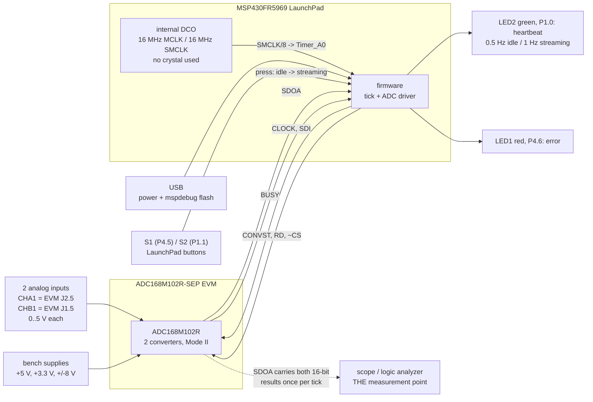
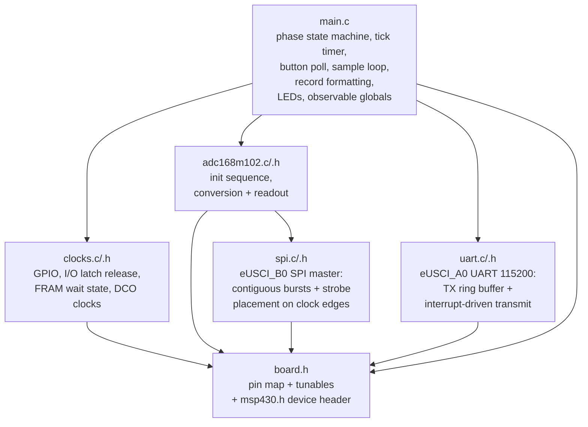
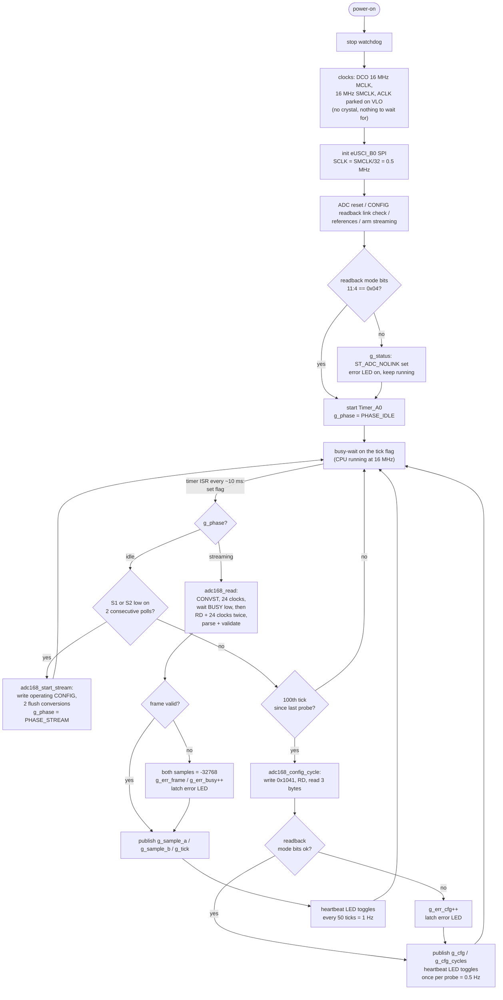
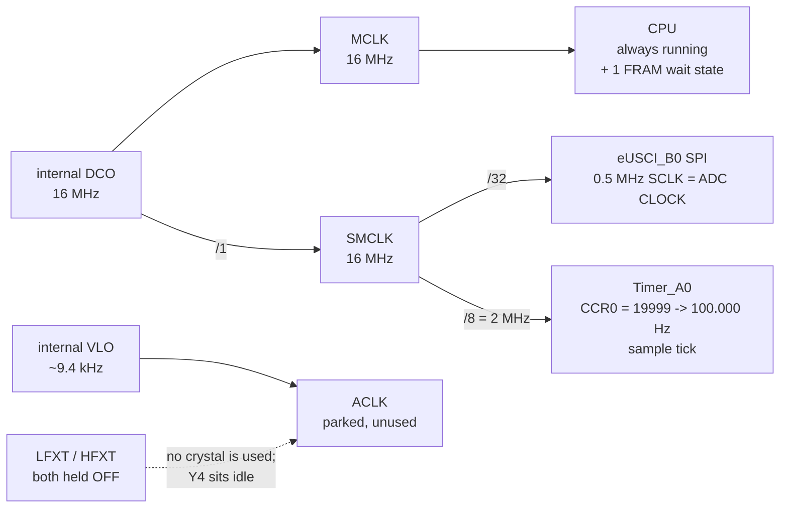
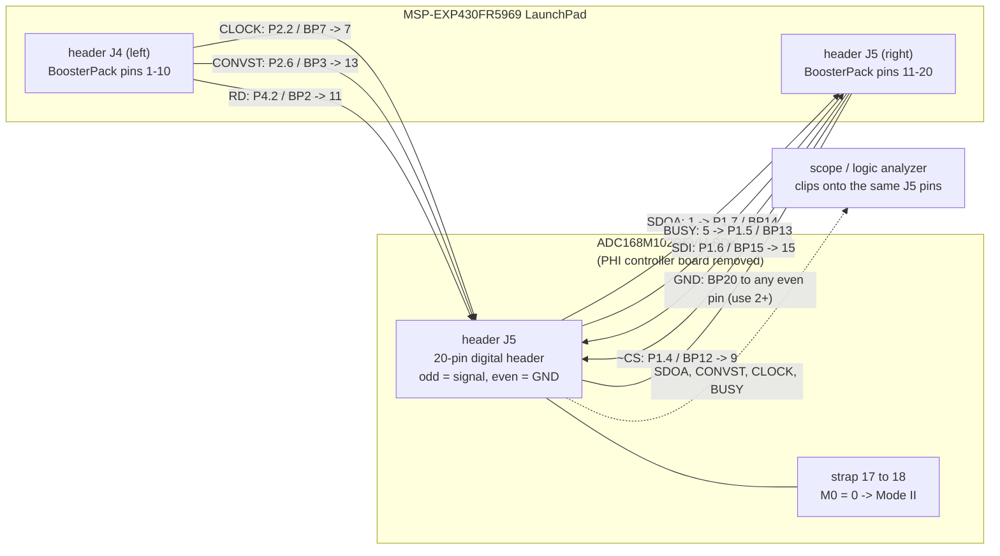
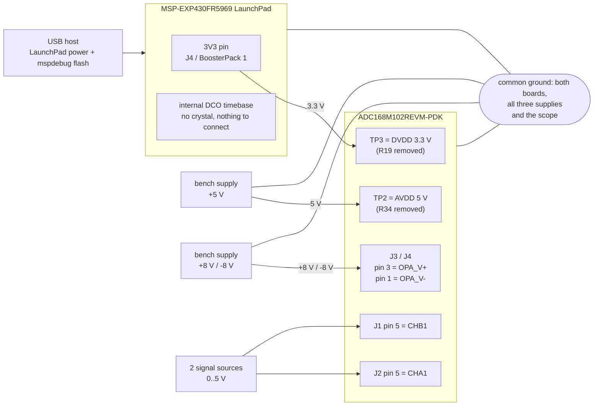
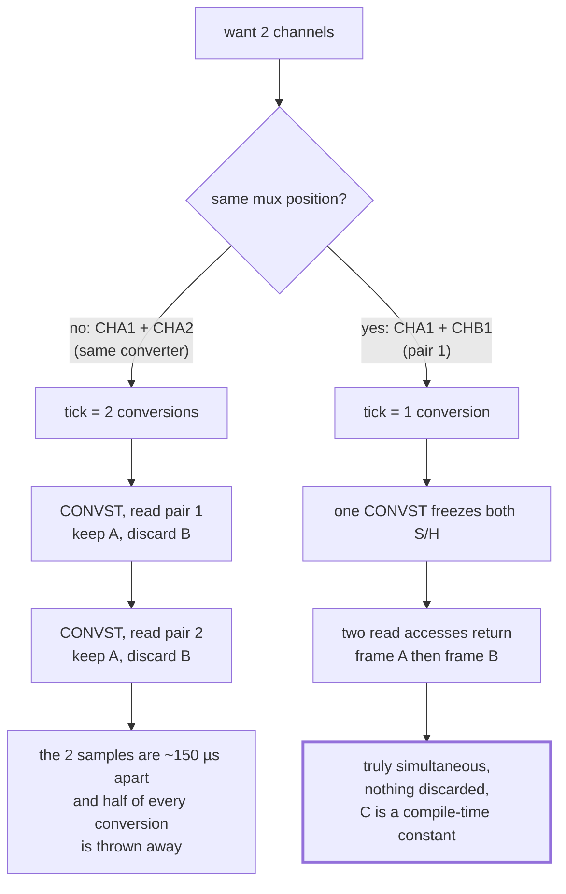
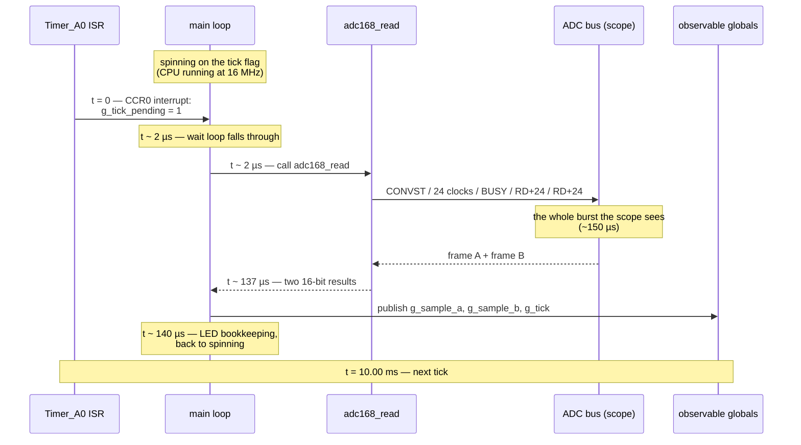
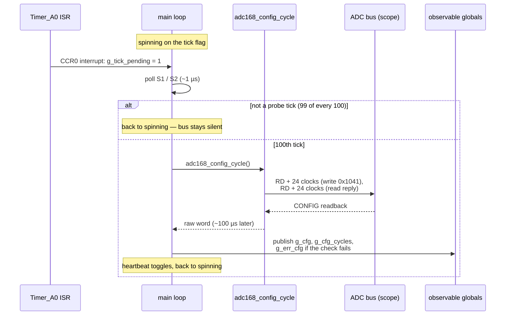
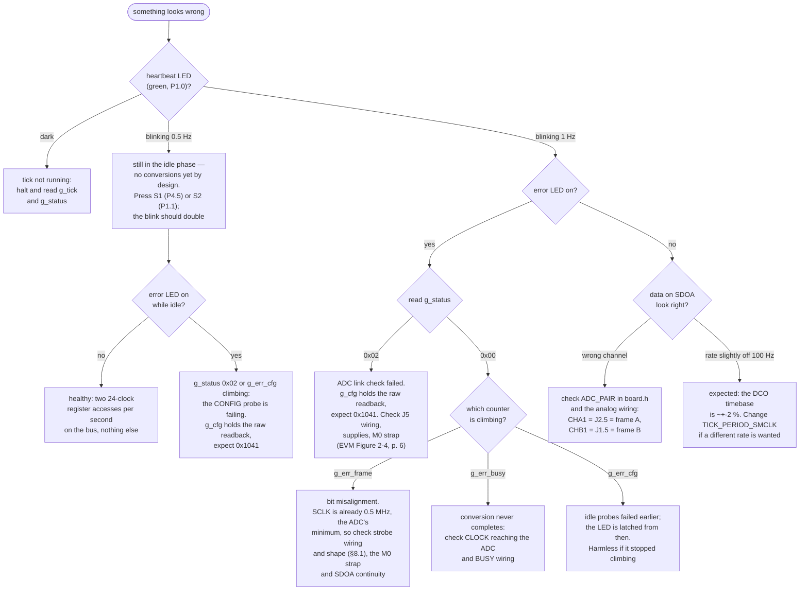

# Design

The complete "what, why and how" of the firmware, in one document: a summary
of the system and its decisions first, then the background needed to follow
them, then the implementation in detail, then how to observe and diagnose the
running system.

Read **Part I** alone if you only want the overview. Read **Part II** if you
have never worked with an ADC or SPI before — everything after it assumes
those ideas.

## Reference documents

Every non-obvious claim below is cited back to the primary source. Citations
use these short keys and give the **PDF page number**, which for all four
documents equals the printed page number:

| Key | Document | TI literature number | In this repo |
|---|---|---|---|
| **ADC** | ADC168M102R-SEP data sheet | SBASAW9, December 2024 | [`ADC168M102R-SEP datasheet - sbasaw9.pdf`](<ADC168M102R-SEP datasheet - sbasaw9.pdf>) |
| **MCU** | MSP430FR596x, MSP430FR594x mixed-signal microcontrollers data sheet | SLAS704G, Oct 2012 – rev. Aug 2018 | [`MSP430FR596x... datasheet (Rev. G) - msp430fr5969.pdf`](<MSP430FR596x, MSP430FR594x Mixed-Signal Microcontrollers datasheet (Rev. G) - msp430fr5969.pdf>) |
| **EVM** | ADC168M102REVM-PDK evaluation module user's guide | SBAU478, February 2025 | [`ADC168M102REVM-PDK ... - sbau478.pdf`](<ADC168M102REVM-PDK Evaluation Module User's Guide - sbau478.pdf>) |
| **LP** | MSP430FR5969 LaunchPad development kit (MSP-EXP430FR5969) user's guide | SLAU535B, Feb 2014 – rev. Jul 2015 | [`MSP430FR5969 LaunchPad ... (Rev. B) - slau535b.pdf`](<MSP430FR5969 LaunchPad Development Kit (MSP-EXP430FR5969) User's Guide (Rev. B) - slau535b.pdf>) |

So *(ADC §6.3.1.4, p. 19)* means section 6.3.1.4 on page 19 of SBASAW9.
[Section 18](#18-datasheet-cross-reference-index) collects every citation into
one index, grouped by document.

One non-document reference is cited the same way:
[`workingADC.jpg`](workingADC.jpg) is a logic-analyzer capture of the EVM's
own **PHI controller board** driving this ADC — the manufacturer's working
implementation of the same bus, and the empirical check on strobe shape in
[§8.1](#81-placing-a-strobe-on-the-clock).

Note that **register-level MSP430 programming detail is not in the MCU data
sheet** — bits such as `UCB0CTLW0`, `CSCTL4`, `FRCTL0` and `LOCKLPM5` are
specified in the *MSP430FR58xx/59xx family user's guide* (SLAU367), which is
not bundled here. The MCU data sheet is cited for pin functions, electrical
limits and clock/interface timing; the code comments in [`src/`](../src/) name
the registers.

Contents:

**Part I — Overview**
1. [What the system does](#1-what-the-system-does)
2. [Key design decisions](#2-key-design-decisions)
3. [Software structure](#3-software-structure)
4. [Runtime behaviour](#4-runtime-behaviour)

**Part II — Background from first principles**

5. [What an ADC is](#5-what-an-adc-is)
6. [What SPI is](#6-what-spi-is)
7. [Why this ADC is not a "normal" SPI device](#7-why-this-adc-is-not-a-normal-spi-device)
8. [The trick that makes SPI work anyway: the gated clock](#8-the-trick-that-makes-spi-work-anyway-the-gated-clock)
   - [8.1 Placing a strobe on the clock](#81-placing-a-strobe-on-the-clock)

**Part III — The implementation**

9. [The MSP430 side: clocks, pins, peripherals](#9-the-msp430-side-clocks-pins-peripherals)
10. [Talking to the ADC, step by step](#10-talking-to-the-adc-step-by-step)
11. [Reading two channels: why a pair](#11-reading-two-channels-why-a-pair)
12. [Timing: the 100 Hz tick](#12-timing-the-100-hz-tick)
13. [Putting it together: one tick, start to finish](#13-putting-it-together-one-tick-start-to-finish)

**Part IV — Observing and diagnosing**

14. [Getting at the data: the scope and the serial line](#14-getting-at-the-data-the-scope-and-the-serial-line)
15. [Number formats: decoding a readout burst by hand](#15-number-formats-decoding-a-readout-burst-by-hand)
16. [What can go wrong and how the firmware reacts](#16-what-can-go-wrong-and-how-the-firmware-reacts)
17. [Glossary](#17-glossary)
18. [Datasheet cross-reference index](#18-datasheet-cross-reference-index)

---

# Part I — Overview

## 1. What the system does

An MSP430FR5969 microcontroller (on a TI LaunchPad board) drives an external
precision ADC (TI ADC168M102R-SEP on its evaluation board) to sample two
analog voltages roughly 100 times per second.

The two inputs are **CHA1** (EVM header J2.5) and **CHB1** (J1.5). They sit
on the ADC's two independent converters at the same mux position, so one
conversion digitizes both *at the same instant* and one readout returns
both. Which pair is acquired is the `ADC_PAIR` constant in `board.h`.

**There is no output path off the MCU.** The results are read directly off
the ADC bus with a scope or logic analyzer — SDOA carries both 16-bit results
in the two read accesses that follow every tick. The firmware's only
job is to run that bus traffic reliably at 100 Hz and to flag trouble on
two LEDs.

**Acquisition does not start by itself.** Out of reset the firmware sits in an
**idle phase**: once a second it writes the ADC's CONFIG register with the
"read it back" action and reads the reply — one register write, one register
read, no conversions, and nothing asked of the analog front end. Pressing
either LaunchPad button (**S1** = P4.5 or **S2** = P1.1) rewrites the operating
CONFIG and switches to the **streaming phase**: one conversion + readout every
tick, for good. The heartbeat LED distinguishes them — a 0.5 Hz blink while
idle, 1 Hz while streaming.

That split exists because the two phases fail in different ways and are
diagnosed differently. The idle phase exercises exactly the digital path —
~CS, RD, CLOCK, SDI, SDOA — at a rate a human can watch on a scope, while
supplies, jumper wires and references can still be moved; a mis-wired board
says so once a second instead of once. The streaming phase is the measurement
itself, and starting it deliberately means nothing is converting while the
analog side is still being probed. [§4](#4-runtime-behaviour) has the state
machine; [§12](#12-timing-the-100-hz-tick) covers the timebase both phases
share.



## 2. Key design decisions

| Decision | Choice | Why |
|---|---|---|
| ADC interface | eUSCI_B0 SPI at **0.5 MHz** for CLOCK/SDI/SDOA + three GPIO strobes | The ADC's clock doubles as its conversion clock and the datasheet permits a gated ("burst") clock — which is exactly what an SPI master produces ([§8](#8-the-trick-that-makes-spi-work-anyway-the-gated-clock)). Half-clock mode accepts 0.5–20 MHz *(ADC §6.3.1.4, p. 19)*, and this build sits at the bottom of that range: SMCLK 16 MHz ÷ `ADC_SCLK_DIV` 32. The slow clock is deliberate — 2 µs per bit is enormous setup/hold margin for jumper-wired signals, and it is also what lets the CPU place the CONVST/RD strobes against individual clock edges: a half period is 1 µs against a ~0.5 µs polling loop ([§8.1](#81-placing-a-strobe-on-the-clock)). One conversion still costs only ~150 µs out of a 10 ms tick, so nothing is given up. |
| ADC operating mode | **Plain Mode II** (M0 strapped low), special read **off** (SR=0), pseudo-differential (PDE=1) | Mode II = M0 0, M1 1: manual channel select, SDOA only *(ADC Table 6-5, p. 21)* — M1 high is also what deactivates SDOB, so SDOA is the one serial output. With SR=0 a read access returns one 20-bit frame *(ADC §6.5.2.2, p. 26)*, so the pair's two results take two read accesses (RD + 24 clocks each) instead of one 40-clock burst. It costs one extra strobe and 8 clocks a tick; in exchange every access on the bus has the same shape — RD plus three bytes — whether it carries a register value or half a conversion, and the frame decoder is one routine rather than two. The internal 2.5 V reference is routed as common mode by software, so the EVM needs no jumper changes. |
| Strobe/clock alignment | Every access is one contiguous train of clocks, and the strobe that opens it **straddles that train's first clock**: `spi_burst_strobe()` raises CONVST/RD a few hundred ns before the first rising CLOCK edge and releases it on the **second** rising edge of the same burst | The ADC samples RD and CONVST *at* the first rising CLOCK edge of the access they open and wants them back low about one clock later *(ADC §5.6 t1/t2/t3, p. 9; Figure 5-1, p. 10; §6.5.2.2, p. 26)* — a narrow pulse that has already fallen before the burst begins is one the part never sees at that edge. The release is timed by watching the SCLK pin itself through `P2IN`, not by counting cycles, so it needs no assumption about the eUSCI's start-up delay; the window runs with interrupts masked so the tick ISR cannot make it miss an edge. The burst stays unbroken because `UCB0TXBUF` is reloaded on `UCTXIFG`, while the previous byte is still shifting. Full mechanism, numbers and the one spec deviation: [§8.1](#81-placing-a-strobe-on-the-clock). |
| Input mux | Pseudo-differential **4:1** configuration (`PDE=1`, ADC Table 6-2, p. 17), channel picked by CONFIG `C[1:0]` | Gives four single-ended inputs per converter measured against a common mode, which is what this application wants. `M0 = 0` keeps selection *manual* through `C[1:0]`; the SEQFIFO sequencer applies only to automatic mode (`M0 = 1`) *(ADC §6.3.2.1, p. 21)* and is left at its reset default. |
| Channel selection | Fixed pair, `ADC_PAIR = 1` → `C = 01` → CHA1 + CHB1, set in the init CONFIG word and re-asserted on every access | Picking two channels that share a mux position makes them simultaneous by construction and removes the pipelined channel-rotation entirely ([§11](#11-reading-two-channels-why-a-pair)): the C field is a constant, so a corrupted command can only mis-select for one sample before the next access corrects it. |
| Start of acquisition | Two phases: an idle phase that writes + reads back CONFIG once a second, and a streaming phase entered by pressing S1 or S2 — one way, until reset | Bring-up and measurement want opposite things. Idle proves the digital link at a watchable rate while the analog side is still being wired, probed or powered; streaming is the measurement. Making the transition an explicit press means the ADC never converts into a half-built setup, and the two phases have unmistakably different scope and LED signatures ([§4](#4-runtime-behaviour), [§14](#14-getting-at-the-data-the-scope-and-the-serial-line)). One way because there is no use case for stopping mid-measurement, and a second press during streaming would be a way to lose samples by accident. |
| Button input | S1 (P4.5) and S2 (P1.1), internal pull-ups, **polled** once per tick with a 2-poll (20 ms) debounce — no port interrupt | The CPU already wakes every 10 ms, so the poll is free and the tick spacing *is* the debounce: no second timer, no ISR firing a dozen times inside one contact bounce. Both buttons do the same thing, so the firmware never has to tell them apart. The LaunchPad wires each switch straight to GND with no external pull-up *(LP schematic, p. 37)*, hence `PxREN` + `PxOUT = 1` and active-low sensing. |
| Sample timebase | **No crystal.** Timer_A0 from SMCLK/8 = 2 MHz, period 20000 → exactly 100.000 Hz, all of it derived from the internal DCO | The tick's only job is to space the ADC bursts evenly; nothing measures absolute time from it, so the DCO's ~±2 % is ample and a crystal buys nothing the application can use. Dropping it removes the oscillator-fault handshake, the ~1 s crystal start-up window at every boot, and a whole failure mode — LFXT and HFXT are simply held off, PJ.4/PJ.5 stay plain GPIO, and 2 MHz ÷ 20000 lands on 100.000 Hz exactly, which 32768 Hz never could ([§12](#12-timing-the-100-hz-tick)). |
| Readout | **Two paths.** The ADC bus is the primary measurement point; eUSCI_A0 on the LaunchPad's eZ-FET backchannel (115200-8-N-1) carries one tagged CSV record per tick on top of it | The scope has to be on the bus during bring-up anyway, and SDOA carries both results in full 16-bit resolution — but a scope cannot log an hour of samples, and reading them back one halt at a time from `mspdebug` does not scale. The serial line makes every tick a line of text on the host with no extra hardware, since the backchannel is already there on P2.0/P2.1. It is kept strictly off the critical path: `uart_write()` copies into a 256-byte ring and returns, the eUSCI TX interrupt drains it during the ~98 % of the tick spent spinning, and a host that stalls costs a dropped line counted in `<errs>` rather than a late sample. The two record types are tagged `C` (idle CONFIG probe) and `D` (sample) so one stream carries both phases ([§14](#14-getting-at-the-data-the-scope-and-the-serial-line)). |
| Status reporting | Two LEDs, plus every computed value held in a `volatile` global for the debugger | Enough to tell "alive and ticking" from "something is wrong" at a glance — and, because the heartbeat rate doubles at the phase change, which phase the board is in; `mspdebug` supplies the detail when the LED says to look. |
| Integrity | Every ADC frame carries fixed indicator/zero bits which are checked on every read *(ADC Figure 6-7, p. 27)* | Cheap, continuous self-test of wiring and clock phase; failures are counted in the `errs` column and light the error LED. |
| Toolchain | TI msp430-gcc via CMake cross file; Docker/Podman dev image | Reproducible builds on any host; no IDE dependency. |

## 3. Software structure

```
src/
├── board.h        pin map, tunables (channel pair, SCLK divider, tick
│                 period), pin macros
├── clocks.c/.h    GPIO setup, I/O latch release, FRAM wait state, DCO clocks
├── spi.c/.h       eUSCI_B0 SPI master: contiguous bursts, and the
│                 CONVST/RD strobe placed against their clock edges
├── uart.c/.h      eUSCI_A0 backchannel UART, 115200-8-N-1: ring buffer +
│                 interrupt-driven transmit, never blocks the tick
├── adc168m102.c/.h ADC driver: init sequence, conversion + readout
└── main.c         phase state machine, tick timer, button poll,
                   sample loop, record formatting, LEDs,
                   observable globals
```

Layering (arrows = "uses"):



## 4. Runtime behaviour



Both phases run off the same 100 Hz tick; only what a tick *does* changes.
While idle the scope sees two 24-clock register accesses once a second and a
dead bus in between; after the button press it sees one ~150 µs acquisition
burst per tick, 10 ms apart.

The hand-over tick is the only unusual one: it writes the operating CONFIG and
burns two throw-away conversions (~350 µs, still well inside the 10 ms budget)
before the first real sample lands on the *next* tick. That step is mandatory,
not cosmetic — the idle probe leaves `C = 00` in CONFIG, so without the rewrite
the first conversions would digitize pair 0 instead of `ADC_PAIR`: the right
framing, the wrong channels
([§10.4](#104-the-idle-probe-and-the-hand-over-to-streaming)).

Per-tick budget: ~150 µs on the ADC bus plus a few µs of bookkeeping while
streaming (~100 µs once a second while idle); the rest of the tick the CPU
spins on the tick flag. Useful work is under 2 % of the tick while streaming
and negligible while idle — the CPU itself never stops running.

---

# Part II — Background from first principles

## 5. What an ADC is

An **analog-to-digital converter** measures a voltage and produces a number.
Ours is 16-bit: the number ranges over 65 536 distinct values, so across a
5 V span each step (one "LSB", least significant bit) is 5 V / 65 536 ≈
76 µV. The code is binary two's complement *(ADC Table 6-7, p. 24)*.

Three ideas matter for this design:

**Sample-and-hold.** The input voltage is constantly changing. The ADC
first *tracks* the input, then on a command ("CONVST", conversion start) it
*freezes* a snapshot on an internal capacitor. The conversion then works on
that frozen value, so the reading corresponds to one precise instant.

**Conversion takes time and needs a clock.** This ADC is a *SAR*
(successive approximation) converter — it homes in on the answer one bit
per clock cycle, like a binary search. In this part's default *half-clock
mode* a complete conversion cycle including acquisition needs at least
20 CLOCKs *(ADC §6.3.2.2, p. 21)*; the SAR itself finishes in roughly 18 of
them. Crucially, *the ADC has no clock of its own*: it uses whatever we send
on its CLOCK pin, both for converting and for shifting the result out
*(ADC §6.3.1.4, p. 19)*.

**Reference voltage.** The ADC measures the input *relative to* a reference
voltage (V_REF). Full scale = ±V_REF. Ours has two built-in reference DACs
that we enable and program in software *(ADC §6.5.3, p. 31; Table 6-3, p. 19)*;
we set both to 2.5 V.

### This particular ADC: two converters, eight channels

The ADC168M102R-SEP contains **two** independent 16-bit converters, "A" and
"B", that snapshot at exactly the same instant *(ADC §6.2 functional block
diagram, p. 16)*. In front of each sits a 4-way switch (multiplexer, "mux"):


We tell it which mux position to use (0, 1, 2 or 3), and one conversion
then delivers **channel pair k = (CHAk, CHBk)**.

This firmware needs only **two** channels, and it picks them from the same
mux position: **CHA1 and CHB1** (pair 1). That choice is what makes the
whole acquisition a single conversion per tick — see
[section 11](#11-reading-two-channels-why-a-pair).

### Pseudo-differential inputs and common mode

Each converter actually measures a *difference* between a positive and a
negative input. The mux in front of it can be wired up two ways, and we
choose the second:

| `PDE` | Configuration | Inputs per converter |
|---|---|---|
| 0 | Fully differential 2:1 *(ADC Table 6-1, p. 17)* | 2 pairs, each measured against its own negative pin |
| **1** | **Pseudo-differential 4:1** *(ADC Table 6-2, p. 17)* | **4 single-ended inputs, all measured against a shared common mode** |

In the **pseudo-differential 4:1** configuration the negative input is a
fixed voltage called the **common mode**, and the four CHxx pins per
converter are the positive inputs — eight in total. The same `C[1:0]` bits
that would pick one of two differential pairs now pick one of four
single-ended inputs:

```
  C[1:0]   ADC+     ADC-
    00     CHx0     CMx / REFIOx
    01     CHx1     CMx / REFIOx     <- what this firmware uses
    10     CHx2     CMx / REFIOx
    11     CHx3     CMx / REFIOx
```

We route the internal 2.5 V reference to be that common mode. Consequence: each channel measures its input relative
to 2.5 V, giving a ±2.5 V range around 2.5 V — i.e. 0 V to 5 V
*(ADC Table 6-7, p. 24)*:

| Input voltage | Output code (two's complement) |
|---|---|
| 5.0 V | +32767 (0x7FFF) |
| 2.5 V | 0 (0x0000) |
| 0.0 V | −32768 (0x8000) |

---

## 6. What SPI is

**SPI** (Serial Peripheral Interface) is a simple way for two chips to
exchange bytes over a few wires. One side is the **master** (it generates
the clock — the MSP430 here), the other is the **slave** (the ADC).

Wires:

| Name (generic) | Name on MSP430 | Name on ADC | Direction | Purpose |
|---|---|---|---|---|
| SCLK | UCB0CLK | CLOCK | master → slave | Clock: one pulse per bit |
| MOSI | UCB0SIMO | SDI | master → slave | Data *to* the slave |
| MISO | UCB0SOMI | SDOA | slave → master | Data *from* the slave |
| ~CS | (GPIO P1.4) | ~CS | master → slave | "Chip select": low = you are being talked to |

MSP430 signal names are from *(MCU Table 4-1, pp. 12–15)*; ADC signal names
from *(ADC Table 4-1, pp. 3–4)*.

How a byte moves: the master toggles SCLK eight times. On each pulse, one
bit goes out on MOSI *and* one bit comes back on MISO — SPI is always
full-duplex, even if one direction is carrying junk. Which clock *edge*
(rising or falling) each side uses to change and to read data is fixed by
two settings called **CPOL** (idle level of the clock) and **CPHA**
(which edge samples). Get them wrong and you read every bit one slot late —
garbage. For our ADC:

- The ADC **changes** its output bit on the **rising** edge, so we must
  **read** it on the **falling** edge.
- The ADC **reads** our input bit on the **falling** edge, so we must
  **change** it on the **rising** edge.
- The clock **idles low**.

*(ADC §6.3.2.2, p. 21 — "the first output bit is available with the falling RD
edge, and the following output data bits are refreshed with the CLOCK rising
edge"; waveforms in ADC Figure 5-1, p. 10.)*

That combination is CPOL = 0, CPHA = 1. In TI's eUSCI register naming that
is `UCCKPL = 0` and `UCCKPH = 0` (TI's phase bit is the inverse of the
Motorola convention — a classic trap, called out in `spi.c`).

```
 SCLK  ___|‾‾|__|‾‾|__|‾‾|__|‾‾|__ ...
             ^      ^                  MSP430 samples MISO on falling edges
          ^      ^                     ADC drives MISO on rising edges
 MISO  ---< b7 >< b6 >< b5 >< b4 > ...   (MSB first)
```

**Bursts, not bytes.** The eUSCI is double buffered: `UCTXIFG` sets as soon as
a queued byte moves from `UCB0TXBUF` into the shift register — while that byte
is still going out. Reloading the buffer at that moment means the next byte is
already waiting when the current one ends, so the clock runs straight through
the byte boundary. Reloading only after `UCRXIFG` ("the byte has finished")
instead leaves the shift register empty for the length of a CPU round trip,
which shows up on a scope as a stall of roughly a bit time at every byte
boundary. `spi_burst()` does the former. That same round trip is why
`spi_wait_ready()` is called *before* an access begins rather than inside it:
once a strobe is up the timing is measured in clock edges, and nothing may
block. Where the strobe then sits relative to those edges is
[§8.1](#81-placing-a-strobe-on-the-clock).

A 0.5 MHz clock means each bit takes 2 µs, a byte 16 µs. That is the slowest
the ADC allows — it accepts 0.5–20 MHz in half-clock mode *(ADC §6.3.1.4,
p. 19)* — and running at the bottom of the range leaves both ends with margin
to spare against the eUSCI's SPI-master setup/valid times *(MCU Table 5-19,
p. 39)* and against the stray capacitance of jumper wires.

---

## 7. Why this ADC is not a "normal" SPI device

A typical SPI sensor has a tidy protocol: pull ~CS low, send a command
byte, read back some bytes, release ~CS. This driver keeps that outer
frame — every access asserts ~CS for itself and releases it again — but the
inside of the frame is different in three ways, and the whole driver design
follows from them:

1. **CLOCK is also the conversion clock.** The SAR needs ~18 clock pulses
   to finish converting. Those pulses come from *our* SCLK. So we must send
   clocks even when we have nothing to say, just to make the conversion
   progress. *(ADC §6.3.1.4, p. 19; §6.3.2.2, p. 21.)*

2. **Two extra control strobes.** Besides ~CS there are:
   - **CONVST** — a rising edge freezes the sample-and-holds and arms a
     conversion, which starts on the *next* CLOCK rising edge (setup time
     t1 = 12 ns minimum) *(ADC §6.3.1.1, p. 18; §5.6, p. 9)*.
   - **RD** — a rising edge tells the ADC "start shifting your result out
     on SDOA now", and it *also* opens a 16-clock window in which the ADC
     listens on SDI for a command word *(ADC §6.5.1, p. 24)*.

   Both are ordinary GPIO pins on the MSP430, and both are *level*-relevant
   at the first clock of the access they open: they go up just before it and
   come back down about one clock period later
   *(ADC Figure 5-1, p. 10; t2/t3 in §5.6, p. 9)*. Placing them is
   [§8.1](#81-placing-a-strobe-on-the-clock).

3. **A status output.** **BUSY** goes high while the inputs are in hold mode
   and returns low when the conversion completes *(ADC Table 4-1, p. 3)*.
   We must not raise CONVST while it is high *(ADC §6.3.1.1, p. 18)*.

So the ADC has seven wires to us: CLOCK, SDI, SDOA, ~CS, CONVST, RD, BUSY —
all in *(ADC Table 4-1, pp. 3–4)*.

---

## 8. The trick that makes SPI work anyway: the gated clock

Because SCLK is also the conversion clock, one might think we need a
free-running clock signal. We do not. The datasheet says that "when using the
device in burst mode, keep the clock held static low or high when read access
completes and before starting a new conversion" *(ADC §6.3.1.4, p. 19)*. And that
is *exactly* what an SPI master naturally does: the clock only toggles
while a byte is being transferred and sits at its idle level (low, for
CPOL = 0) otherwise.

So the design is:

- **Need N clock pulses?** Transfer N/8 bytes. The bytes' contents may or
  may not matter, but the *pulses* always do.
- **Between bursts** the clock is idle-low, and that quiet is what makes the
  strobes *placeable*: the firmware decides exactly where the first clock
  edge of an access falls, so it can put CONVST and RD in a fixed
  relationship to it. What that relationship is — up before the first rising
  edge, down on the second — is
  [§8.1](#81-placing-a-strobe-on-the-clock). The rule being satisfied is not
  "never overlap an edge" (the part *wants* the strobe high at the first
  edge) but the width limit: "make sure the CONVST and RD signals are not be
  longer than one clock cycle" *(ADC §6.5.2.2, p. 26; the same sentence for
  `SR = 1` in §6.5.2.3, p. 27)*.

There are two subtle consequences the driver handles explicitly:

- "All register updates become active with the CLOCK rising edge after
  completing the 16-clock-cycle write access" *(ADC §7, p. 32)*. With a gated
  clock, that edge would not arrive until our next transfer. So every register
  write sends **a third, dummy byte** purely to supply that edge (see
  `write_word()`).
- "Changes to the FE, SR, PDE, and CID register bits are active starting from
  the next conversion with a delay of one read access" *(ADC §6.5.2.2, p. 26)*.
  After configuring, the driver performs **two throw-away conversions** so the
  streaming loop only ever sees settled framing (see the end of
  `adc168_init()`).

### 8.1 Placing a strobe on the clock

The datasheet is specific about where a strobe sits. In the half-clock timing
diagram *(ADC Figure 5-1, p. 10)* CONVST and RD both

- **rise before** the first rising CLOCK edge of the access they open — at
  least t1 = 12 ns of setup *(ADC §5.6, p. 9)*;
- are **still high at** that edge, which is where the part samples them; and
- **fall within about one clock period** of it — the hatched trailing edge in
  the figure, and the t2/t3 "high time, max 1 t_CLK" rows of the same table.

So a strobe straddles the first clock of its burst; it is not a narrow pulse
in the quiet gap ahead of it. A pulse that has already fallen when the first
edge arrives is one the ADC never sees there.

```
   CLOCK   ______|‾|_|‾|_|‾|_|‾|_ ...   24 clocks, one contiguous burst
   CONVST  ___|‾‾‾‾‾‾‾|_____________
   or RD      ^       ^
              |       +-- released on rising edge 2
              +-- up before rising edge 1 (t1 setup), still high at it
```

`spi_burst_strobe()` in `spi.c` produces that shape, and it owns **both**
edges of the strobe, because both are timed against a clock it is about to
start:

1. The caller — `rd_access()`, or the conversion step of `adc168_read()` —
   calls `spi_wait_ready()` first, so the shift register is drained, SCLK is
   parked at idle low and `UCB0TXBUF` will accept a byte without blocking.
   All waiting happens here, before anything is timed.
2. Interrupts are masked. The whole window is ~2.5 µs and the only thing it
   can delay is the 100 Hz tick flag; a tick ISR landing inside it, on the
   other hand, would let a clock edge slip past unseen and release the strobe
   a full clock late.
3. The strobe goes high, and **one instruction later** (~250 ns at 16 MHz,
   plus the eUSCI's own start-up) the first byte is written to `UCB0TXBUF` —
   which is what sets SCLK running. That gap is t1, with orders of magnitude
   to spare over its 12 ns minimum.
4. The CPU then watches SCLK *itself*. P2.2 is muxed to UCB0CLK, but `PxIN`
   reflects the physical pin whatever function drives it, so polling `P2IN`
   bit 2 sees the real edges: high, low, high — rising edge 1, falling edge
   1, rising edge 2 — and on that last transition the strobe is cleared.
5. The rest of the burst runs normally, reloading `UCB0TXBUF` on `UCTXIFG`
   so the 24 clocks stay unbroken. The two clocks spent polling sit inside
   the first byte's 16 µs, so the second byte is still queued long before the
   shift register empties.

Watching the pin beats counting cycles: nothing in step 4 assumes how long
the eUSCI takes to produce its first edge after the buffer write, and the
same code follows the clock unchanged if `ADC_SCLK_DIV` moves.

**What it costs.** The poll loop is a bit test, a branch and a guard
decrement — about 8 cycles, 0.5 µs at 16 MHz MCLK — so the release lands
between roughly 0.25 µs and 0.8 µs after the second rising edge, inside that
clock's high phase. That granularity also puts a floor under the bus speed:
the loop must be short compared with a half period (1 µs at 0.5 MHz), so
`spi.c` carries an `#error` below `ADC_SCLK_DIV = 32`. Going faster means
driving the release from a Timer_A capture/compare output instead of from the
CPU — the strobe pins would have to move to timer-capable ones — which is a
real change, not a one-line divider edit.

**One honest deviation.** Total high time comes out at roughly 1.2–1.5 t_CLK:
the lead, one full clock period, and the release granularity. t2 and t3 cap
it at 1 t_CLK *(ADC §5.6, p. 9)*, and §6.5.2.2 says it plainly — "make sure
the CONVST and RD signals are not be longer than one clock cycle to provide
proper functionality and avoid output data corruption" *(ADC p. 26)*. From
software, at this clock rate, it cannot be squeezed under that cap. The
evidence that it is tolerable is the reference hardware: the PHI controller
board that ships with the EVM, captured in
[`workingADC.jpg`](workingADC.jpg) driving this same part, holds CONVST high
for about 1.5–2 clock periods with the fall landing on the second rising edge
— the same shape, slightly wider than ours.

If bad frames ever do point back here, the fix is the timer-driven release
above, not a narrower software pulse: shortening the strobe below one clock
period puts its *falling* edge back before the edge the ADC samples it on,
which is the arrangement this design has just moved away from.

---

# Part III — The implementation

## 9. The MSP430 side: clocks, pins, peripherals

### 9.1 The MSP430FR5969 in one paragraph

A 16-bit microcontroller with 64 KB of FRAM (non-volatile memory that is
also writable like RAM), 2 KB SRAM, and a set of on-chip peripherals. The
ones we use: **eUSCI_B0** (configured as SPI, for the ADC bus), **eUSCI_A0**
(configured as a UART, for the backchannel serial link), **Timer_A0** (for the
100 Hz tick), and the **clock system** that generates the CPU and peripheral
clocks. That is the whole list. *(MCU device comparison, p. 5: eUSCI_B0
supports I²C and SPI, eUSCI_A0 UART/IrDA/SPI; TA0 is the 3-CCR Timer_A
instance.)*

### 9.2 Clock tree



- **DCO** = digitally-controlled oscillator, the chip's internal RC clock.
  Its selectable ranges and tolerances are in *(MCU p. 29)*; 16 MHz is one of
  the calibrated settings. 16 MHz for the CPU means FRAM needs one *wait
  state* — the zero-wait-state limit is 8 MHz *(MCU pp. 17–18,
  `NWAITSx = 0` vs `= 1`)* — which is why `clocks.c` writes `FRCTL0` before
  raising the clock.
- **SMCLK at 16 MHz** feeds everything else. It is left *undivided*, equal to
  MCLK, so the design has a single system frequency: the only other rate in it
  is the ADC bus clock. The SPI divides SMCLK by 32 → 0.5 MHz SCLK, which is
  the ADC's CLOCK; Timer_A0 divides it by 8 → 2 MHz, which is the tick's
  timebase. The eUSCI's own SPI-master clock ceiling is in
  *(MCU Table 5-18, p. 38)* — irrelevant at this rate, but the reason the
  divider can be moved back up if the bus is ever wanted faster.
- **No crystal at all.** Both oscillators are held off (`CSCTL4 =
  LFXTOFF | HFXTOFF`), so PJ.4/PJ.5 (LFXIN/LFXOUT) stay plain GPIO outputs at
  0 and the LaunchPad's fitted **Y4** *(LP §2.2.2, p. 8; LP schematic, p. 37)*
  simply never oscillates — it is a passive part with both ends held static,
  so it costs nothing to leave in place. Nothing on the board needs a
  precision timebase: the tick spaces the ADC bursts, and every result is
  timestamped by the scope, not by the MCU.
- **What that buys.** No oscillator-fault handshake, no `LFXTOFFG`/`OFIFG`
  clear-and-retest loop, and above all no start-up window — a 32 kHz crystal
  needs hundreds of milliseconds to reach amplitude, so the old bring-up spent
  up to **1 s** of every boot waiting for it, and carried a failure mode
  (`ST_NO_LFXT`) for the case where it never started. All of that is gone;
  boot is immediate and `clock_init()` can no longer fail.
- **ACLK is parked on the VLO** (~9.4 kHz) rather than left at its reset
  default of LFXTCLK. Nothing is timed from ACLK, but pointing it at a
  disabled oscillator would keep requesting a dead source and keep the
  oscillator-fault flag latched, so the VLO is simply a safe parking spot.
- **No low-power mode is used.** The CPU is clocked at 16 MHz from reset until
  power-off and is never halted: between ticks `main()` busy-waits on the flag
  the timer ISR raises, so `LPM0`–`LPM4` appear nowhere in the firmware. The
  one register bit that still carries the name, `LOCKLPM5` in `PM5CTL0`, is the
  FRAM-family I/O latch release and must be written for any pin configuration
  to take effect ([§9.3](#93-pin-map)); it has nothing to do with entering a
  low-power state here.
- **Two timings, and only two.** 16 MHz for the CPU and every peripheral, and
  0.5 MHz on the ADC bus. Timer_A0's 2 MHz count clock is an internal detail of
  hitting 100.000 Hz exactly, and ACLK's ~9.4 kHz is parked and unused.
- **Everything therefore runs at DCO accuracy, ~±2 %** — the tick, the SPI
  bursts and the millisecond `__delay_cycles()` waits alike.

### 9.3 Pin map

J5 pin numbers are from the EVM's probe/controller header *(EVM Figure 2-4,
p. 6)*; the "pin function" column names the MCU data sheet table that lists
each pin's `PxSEL1`/`PxSEL0` encodings.

| MSP430 pin | Function | Wire to ADC (EVM J5 pin) | Pin functions (MCU) |
|---|---|---|---|
| P2.2 | eUSCI_B0 clock (SCLK) | CLOCK (7) | Table 6-52, p. 90 |
| P1.6 | eUSCI_B0 SIMO (MOSI) | SDI (15) | Table 6-51, p. 89 |
| P1.7 | eUSCI_B0 SOMI (MISO) | SDOA (1) | Table 6-51, p. 89 |
| P1.4 | GPIO output | ~CS (9) — asserted per access | Table 6-50, p. 88 |
| P2.6 | GPIO output | CONVST (13) | Table 6-54, p. 94 |
| P4.2 | GPIO output | RD (11) | Table 6-58, p. 101 |
| P1.5 | GPIO input, pulldown | BUSY (5) | Table 6-50, p. 88 |
| PJ.4 / PJ.5 | GPIO output, low | nothing — LFXT is off, so the onboard crystal **Y4** is unused | Table 6-60, p. 106 |
| P1.0 / P4.6 | GPIO output | LEDs, on the LaunchPad (heartbeat / error) | Tables 6-49, p. 86 / 6-59, p. 103 |
| P4.5 | GPIO input, pull-up | button S1, on the LaunchPad | Table 6-59, p. 103 |
| P1.1 | GPIO input, pull-up | button S2, on the LaunchPad | Table 6-49, p. 86 |

The last four rows need no wiring: the LEDs and both buttons are on the
LaunchPad itself *(LP §2.2.2, p. 8, and schematic, p. 37)*. PJ.4 and PJ.5 are
not brought out to a header at all — they go only to Y4 — and since no crystal
is used they are simply left in the "output low" state every unused pin gets,
which holds the passive crystal static. The buttons short their pin to
ground when pressed and float otherwise, so `clocks.c` enables each pin's
internal resistor as a **pull-up** (`PxDIR = 0`, `PxREN = 1`, `PxOUT = 1`) and
a press reads as a low level. The LaunchPad's own naming is worth keeping
straight, because the two user-interface clusters are on opposite ports: the
left cluster is **S1 (P4.5) + LED1, red (P4.6)**; the right is **S2 (P1.1) +
LED2, green (P1.0)**. This firmware uses the green LED as the heartbeat and
the red one as the error light.

The two analog inputs are not MSP430 pins at all — they go straight into
the EVM's op-amp buffers on its own headers *(EVM §2.2 and Figure 2-3, p. 5)*:

| ADC channel | EVM header pin | Buffer | On SDOA |
|---|---|---|---|
| CHA1 | J2 pin 5 (even pins GND) | OPA4H014-SEP U2C | frame A |
| CHB1 | J1 pin 5 (even pins GND) | OPA4H014-SEP U1C | frame B |

Those buffers need the ±8 V supplies on J3/J4 — the EVM specifies
6 V ≤ OPA_V+ ≤ 10 V and −10 V ≤ OPA_V− ≤ 0.35 V on J3[3]/J4[3] and
J3[1]/J4[1] *(EVM Table 1-1, p. 3)*. The other six channel inputs are left
open.

MSP430 pins are multi-function; two "select" bits per pin decide whether
the pin is plain GPIO or belongs to a peripheral. `clocks.c` sets those
(`PxSEL1`/`PxSEL0`) for the SPI pins — and only those, since no crystal pins
are in use. FRAM-family parts
also keep all pins in high-impedance after reset until a lock bit
(`LOCKLPM5`) is cleared: "after a BOR reset, the ports must be configured
first and then the `LOCKLPM5` bit must be cleared" *(MCU p. 63)* — done right
after pin configuration.

The ADC's mode pin **M0 is strapped to ground on the EVM header** (J5.17,
*EVM Figure 2-4, p. 6*). Together with M1 (pulled high on the EVM) this puts
the ADC in "Mode II": manual channel selection through SDI, data on SDOA only
*(ADC Table 6-5, p. 21)*.

The same connections seen from the bench — which LaunchPad header pin goes to
which EVM pin, plus the supplies, the analog inputs and the board mods — are in
[§9.4](#94-wiring).

### 9.4 Wiring

[§9.3](#93-pin-map) lists the connections from the MCU's point of view — which
port pin carries which signal. This section is the same information from the
*bench's* point of view: what physically has to be connected between the two
boards, the bench supplies and the signal sources, before any of the firmware
below can run. Nothing here is done in software; it is all jumper wires,
one solder strap, and two removed resistors.

> **The two boards reuse each other's header names.** The LaunchPad's
> BoosterPack headers are **J4** (left, BoosterPack pins 1–10) and **J5**
> (right, pins 11–20); the EVM has **J5** for the digital bus, **J1/J2** for
> the analog inputs and **J3/J4** for the op-amp rails. Throughout this
> document a bare J-number is the **EVM's**; the LaunchPad's are always
> written out as "LaunchPad J4" / "LaunchPad J5".

#### The digital bus

Seven signals plus a ground run between the boards. The LaunchPad brings its
pins out on two BoosterPack headers — **J4** (left, BoosterPack pins 1–10) and
**J5** (right, BoosterPack pins 11–20); which port pin lands on which
BoosterPack pin is *(LaunchPad Figure 15, p. 21)*. On the EVM's J5, signals are
on the odd pins and every even pin is ground *(EVM Figure 2-4, p. 6)*.



| Signal | Dir | LaunchPad pin | LaunchPad header | EVM J5 pin |
|---|---|---|---|---|
| CLOCK | → | P2.2 (UCB0CLK) | J4, BoosterPack 7 | 7 |
| SDI | → | P1.6 (UCB0SIMO) | J5, BoosterPack 15 | 15 |
| SDOA | ← | P1.7 (UCB0SOMI) | J5, BoosterPack 14 | 1 |
| ~CS | → | P1.4 | J5, BoosterPack 12 | 9 |
| CONVST | → | P2.6 | J4, BoosterPack 3 | 13 |
| RD | → | P4.2 | J4, BoosterPack 2 | 11 |
| BUSY | ← | P1.5 | J5, BoosterPack 13 | 5 |
| DGND | — | GND | J5, BoosterPack 20 | any even pin — **run at least two** |

Three more J5 pins are settled on the EVM itself rather than wired across:

| EVM J5 pin | Signal | What to do |
|---|---|---|
| 17 | M0 | **Strap to pin 18 (GND).** With M1 pulled high on the EVM this selects Mode II *(ADC Table 6-5, p. 21)* |
| 19 | M1 | Leave open — the EVM already pulls it high |
| 3 | SDOB | Leave open — Mode II never drives it |

Each of those bus signals reaches J5 through a 49.9 Ω series resistor on the
EVM *(EVM Figure 2-4, p. 6)*, which together with the deliberately slow
0.5 MHz bus gives long unshielded jumpers plenty of margin. Still keep the
wires short (≲10 cm), keep CLOCK away from SDOA, and use both ground returns.
There is no slower setting to fall back on — 0.5 MHz is the ADC's minimum — so
if frames come back corrupted the cause is wiring, not bus speed
([§16](#16-what-can-go-wrong-and-how-the-firmware-reacts)).

#### Power, analog inputs and the timebase

The PHI controller board that normally sits on the EVM **must be removed** — it
drives the same digital lines the LaunchPad now drives, and two masters on one
bus is a contention fault, not a race. Removing it also takes away the EVM's
supplies, so DVDD and AVDD have to be fed by hand: remove **R19** and feed DVDD
at **TP3**, remove **R34** and feed AVDD at **TP2** *(EVM §2.1, p. 4)*.



| Rail | From | To | Limits *(EVM Table 1-1, p. 3)* |
|---|---|---|---|
| DVDD 3.3 V | LaunchPad 3V3 (J4, BoosterPack 1) | EVM **TP3**, R19 removed | 2.3–5.5 V |
| AVDD 5 V | external bench supply | EVM **TP2**, R34 removed | 2.7–5.5 V; 3.3 V is fine for digital bring-up, at reduced input range |
| OPA_V+ ≈ +8 V | external bipolar supply | EVM **J3[3]** and **J4[3]** | 6 V ≤ OPA_V+ ≤ 10 V |
| OPA_V− ≈ −8 V | external bipolar supply | EVM **J3[1]** and **J4[1]** | −10 V ≤ OPA_V− ≤ 0.35 V |

The ±8 V rails only feed the OPA4H014-SEP input buffers. Digital bring-up — the
CONFIG readback, the frame checks, the tick rate — works without them; they are
required before any *analog* reading means anything.

Analog inputs go onto the EVM's own op-amp headers, not through the LaunchPad
at all (odd pins signal, even pins ground) *(EVM §2.2 and Figure 2-3, p. 5)*:

| ADC channel | EVM header pin | Appears on SDOA as |
|---|---|---|
| CHA1 | **J2 pin 5** | frame A — the first read access after BUSY falls |
| CHB1 | **J1 pin 5** | frame B — second 20 clocks |

The other six channel inputs (J2.1/3/7, J1.1/3/7) stay open, and jumpers
**JP1/JP2 stay in their default `CMx_EXT` position** — the common mode comes
from the ADC's internal reference over the bus, set by firmware in
[§10.2](#102-the-initialization-sequence-adc168_init), so no jumper move is needed.

The timebase needs **no connection at all** and **no crystal**: it comes from
the MCU's internal DCO, via SMCLK/8 into Timer_A0
([§12](#12-timing-the-100-hz-tick)). The LaunchPad's onboard 32.768 kHz
crystal **Y4** across PJ.4/PJ.5 *(LaunchPad §2.2.2, p. 8, and Schematic 1,
p. 37)* is left unused — fitted or not, damaged or not, it makes no difference
to this firmware.

#### Pre-power checklist

1. PHI controller board unplugged from the EVM.
2. R19 and R34 removed; TP3 and TP2 wired to 3.3 V and 5 V.
3. EVM J5 pin 17 strapped to pin 18 (M0 = 0).
4. Seven signal wires plus **two** ground wires between the boards.
5. JP1/JP2 in `CMx_EXT` (default — leave them alone).
6. Every ground tied together: both boards, all three supplies, scope.
7. ±8 V present if you intend to read real analog values.

---

## 10. Talking to the ADC, step by step

### 10.1 The command word

Every 16-bit word we send to the ADC (during the 16-clock window after an
RD strobe) is a **CONFIG register write** *(ADC Figure 7-2 and Table 7-2,
pp. 33–35)*. Its fields, MSB first:

```
 bit 15 14 | 13 12 | 11 10 | 9  | 8  | 7  | 6   | 5   | 4  | 3 2 1 0
     C[1:0]| R[1:0]| PD    | FE | SR | FC | PDE | CID | CE | A[3:0]
```

The ones we use:

| Field | Meaning | Our value |
|---|---|---|
| C | which channel pair to convert **next** | `ADC_PAIR` (01) — a compile-time constant, re-sent on every access |
| R | 00 = "only update C"; 01 = "rewrite the whole register" | 01 at init, 00 in the per-conversion command |
| SR | special read: one RD delivers *both* converters' results | **0** — not used; plain Mode II, one frame per read access *(ADC §6.5.2.2)* |
| PDE | pseudo-differential (8 single inputs vs common mode) | 1 |
| CID | 1 = omit the indicator bits from frames | 0 (we want them for checking) |
| A | an *action*: 0000 nothing, 0001 "read CONFIG back", 0100 software reset, x010/x101 "the next word goes to reference DAC 1/2", 1100 "the next word goes to REFCM" | varies |

The A-field encodings are listed in *(ADC Table 7-2, p. 34)*. The pattern for
the "next word goes to register X" actions is a two-step write: first the
CONFIG word carrying the address, then the value — illustrated in
*(ADC Figure 7-1, p. 32)*.

### 10.2 The initialization sequence (`adc168_init()`)

```
 (~CS idles high; each step below is one self-contained access —
  ~CS low, strobe + 24 clocks, ~CS high again)

 1. write 0x0004                  soft reset (A=0100): everything to defaults
 2. write 0x1041                  R=01, PDE=1, A=0001 -> "send CONFIG back"   \ adc168_
 3. RD-strobed burst, 3 bytes     the readback arrives; check bits 11:4 == 0x04 > config_
                                  (PDE=1, all else 0). Wrong -> ST_ADC_NOLINK. / cycle()
 4. write 0x1042 then 0x03FF      REFDAC1 <- enable, 2.5 V
 5. write 0x1045 then 0x03FF      REFDAC2 <- enable, 2.5 V
 6. write 0x104C then 0xFF00      REFCM   <- all channels use REFIO1 as common mode
 7. wait 10 ms                    reference capacitors settle (t_REFON = 8 ms)
 8. write 0x5040                  R=01, SR=0, PDE=1, CID=0, C=01 (real config;  \ adc168_
                                  C = ADC_PAIR, so conversion 1 is pair 1)      > start_
 9. two throw-away conversions    flush the "one read access late" pipeline     / stream()
```

Steps 2–3 and steps 8–9 are the two reusable halves, and `main()` calls both
of them again at runtime: the probe once a second while idle, the arming pair
once when a button is pressed ([§10.4](#104-the-idle-probe-and-the-hand-over-to-streaming)).
Note that the operating word is written *after* the reference registers, not
before: the REFDAC/REFCM pointer words are themselves CONFIG writes carrying
the same mode bits (`R=01`, `SR=0`, `PDE=1`) with `C=00`, so nothing converts
while they are in flight and step 8 is what finally installs `C = ADC_PAIR`.
Every word in the sequence carries the same mode bits — only `C` and the
`A` action differ — which is what makes the probe an honest rehearsal of the
framing streaming will use.

Sources for each step: soft reset *(ADC §6.4.1.4, p. 23; A = 0100 in
Table 7-2, p. 34)*; CONFIG readback action *(ADC Table 7-2, p. 34)*; the
operating word's SR/PDE/CID/C fields *(ADC Table 7-2, pp. 33–34)*; the REFDAC
registers and their 2.5 V code *(ADC Figures 7-4/7-5 and Tables 7-3/7-4, p. 36;
setting examples in Table 6-3, p. 19)*; REFCM *(ADC Figure 7-9 and Table 7-7,
pp. 40–41)*; t_REFON = 8 ms max with C_REF = 22 µF *(ADC §5.7, p. 10)*, and the
EVM does fit 22 µF on REFIO1/REFIO2 *(EVM §2.3, p. 6)*; the two-conversion
flush *(ADC §6.5.2.2, p. 26)*.

As a conversation between the two chips:

```mermaid
sequenceDiagram
    autonumber
    participant M as MSP430 (adc168_init)
    participant A as ADC168M102R

    Note over M,A: ~CS idles high; every access below frames itself<br/>(~CS low → strobe + 24 clocks → ~CS high)
    M->>A: write 0x0004  — soft reset, A=0100
    M->>A: write 0x1041  — R=01, PDE=1, A=0001 "send CONFIG back"
    M->>A: RD high + 3 bytes of clock (RD released on clock 2)
    A-->>M: CONFIG readback
    alt bits 11:4 == 0x04
        Note over M: link OK
    else mismatch (open wire / unpowered / wrong strap)
        Note over M: g_status = ST_ADC_NOLINK,<br/>raw value parked in g_cfg,<br/>error LED on before the first tick
    end
    M->>A: write 0x1042 then 0x03FF — REFDAC1 on, 2.5 V
    M->>A: write 0x1045 then 0x03FF — REFDAC2 on, 2.5 V
    M->>A: write 0x104C then 0xFF00 — REFCM: all channels use REFIO1
    Note over M,A: wait 10 ms — reference caps settle (t_REFON = 8 ms)
    M->>A: write 0x5040  — R=01, SR=0, PDE=1, C=ADC_PAIR
    M->>A: two throw-away conversions
    A-->>M: discarded (flushes the "one read access late" pipeline)
    Note over M: init leaves the part armed;<br/>main() then idles in the probe phase<br/>until a button is pressed
```

Step 3 is the **link check**: if MISO is dead (open wire, ADC unpowered,
wrong strap) we read all-zeros or all-ones and the mode bits will not
match — the firmware then sets `ST_ADC_NOLINK`, lights the error LED before
the first tick, and parks the raw value in `g_cfg` for the debugger. Note
that `g_cfg` is the *link-check* readback (expected `0x1041`), captured at
step 3 — before the operating word of step 8 is written, so it does not
carry the channel selection. Every idle-phase probe overwrites `g_cfg` with
a fresh copy of the same readback, so it always reflects the most recent
exchange rather than only the one at power-on.

Steps 4–6 matter because the internal references are **off by default** —
REFDAC1/REFDAC2 reset to `0x07FF`, which has the power-down bit set
*(ADC Figures 7-4/7-5, p. 36)* — so without them the ADC would convert against
nothing. Step 6 is what makes the pseudo-differential 4:1 configuration usable:
the `CMxx` bits choose the *internal* reference over the external CMA/CMB pins,
and the `Rxx` bits choose REFIO1 (the 2.5 V DAC from step 4) over REFIO2
*(ADC Table 7-7, pp. 40–41; block diagram in §6.3.1, p. 20)*. Writing `0xFF00`
arms all eight channels even though only two are read — it costs one word and
keeps `ADC_PAIR` a one-line change. Doing it in firmware is also why the EVM's
JP1/JP2 jumpers can stay in their default `CMx_EXT` position *(EVM §2.2, p. 5)*.

> **A datasheet trap.** §6.3.1.1 *(ADC p. 17)* says "In pseudo-differential
> mode, channel selection is performed with the SEQFIFO register." That
> sentence is about *automatic* channel selection, which is `M0 = 1`: §6.3.2.1
> *(ADC p. 21)* puts "for pseudo-differential inputs, the internal sequencer
> controls the input multiplexer" inside its automatic-mode paragraph, and
> Table 6-5 on the same page defines `M0 = 0` as manual selection through SDI.
> We strap `M0 = 0`, so `C[1:0]` steers the mux, per Table 6-2 *(ADC p. 17)*.
> SEQFIFO is never written; its reset value has `SL = 00`, whose own
> description reads "Do not use; use mode I or II instead, where M0 is 0"
> *(ADC Table 7-6, p. 37)*. Leaving it alone also satisfies REFCM's "set this
> register before setting the REFCM register" ordering note *(ADC p. 37,
> footnote to Table 7-6)* for free.

### 10.3 One conversion + readout (`adc168_read()`)

```
   ~CS     ‾|_____________|‾‾‾|___________|‾‾‾|___________|‾‾‾‾‾‾‾‾‾
   CONVST  _|‾‾‾|___________________________________________________
   CLOCK   ___xxxxxxxxxxxxx____xxxxxxxxxxxx____xxxxxxxxxxxx_________
               ^ 24 conv.        ^ 24 readout    ^ 24 readout
                 clocks            clocks (A)      clocks (B)
   BUSY    ___|‾‾‾‾‾‾‾‾|_____________________________________________
   RD      __________________|‾‾‾|________|‾‾‾|_____________________
   SDOA    --------------------[ frame A ]--[ frame B ]--------------
   SDI     [pair cmd]----------[pair cmd]---[pair cmd]---------------
```

Each strobe rises just before its burst and falls on that burst's **second**
rising CLOCK edge — it straddles the first clock rather than sitting in the
gap ahead of it ([§8.1](#81-placing-a-strobe-on-the-clock)).

**~CS frames each burst individually.** It goes low just ahead of the strobe
and back high once the burst's last CLOCK edge has passed, so all three
accesses in a tick are self-contained and the bus returns to a fully idle
state — CLOCK low, ~CS high, both strobes low — in between. The only timing
the datasheet attaches to the line is t_D6 = 6 ns from the ~CS rising edge to
SDOA tri-stating *(ADC §5.7, p. 10)*, so the single instruction between the
last clock and the release is ample. This is what the PHI reference board
does in `docs/workingADC.jpg`; an earlier revision of this firmware instead
dropped ~CS once at init and left it low for the whole session, which the
part also accepts but which makes the scope trace harder to read.

1. **Check BUSY is low.** "Do not issue a rising CONVST edge during a
   conversion (that is, when BUSY is high)" *(ADC §6.3.1.1, p. 18)*.
   Then `spi_wait_ready()` and `~CS` low: the SPI must be idle *and* primed
   before ~CS and the strobe, so that once CONVST is up nothing can block
   before the clock starts.
2. **Raise CONVST and start the burst** — one call, `spi_burst_strobe()`,
   because the two are timed together ([§8.1](#81-placing-a-strobe-on-the-clock)).
   The sample-and-holds freeze on the rising edge; the conversion starts on
   the first CLOCK rising edge, for which CONVST needs t1 = 12 ns of setup
   *(ADC §6.3.1.1, p. 18)*; CONVST is released on the second rising edge.
3. **The burst itself is 3 bytes = 24 clocks.** Half-clock mode needs at
   least 20 CLOCKs for a complete conversion cycle *(ADC §6.3.2.2, p. 21)*;
   24 leaves margin. (We put the channel command in the first byte too —
   harmless if ignored, correct if latched.)
4. **Wait for BUSY low** with a bounded loop — BUSY returns low when the
   conversion completes *(ADC Table 4-1, p. 3)*. It drops during the burst;
   the wait is a safety net that becomes an error if it times out.
5. **RD-strobed burst, 3 bytes = 24 clocks.** RD's rising edge starts frame
   A on SDOA and opens the 16-clock command window on SDI *(ADC §6.5.1,
   p. 24)*; it is released on the burst's second rising CLOCK edge, exactly
   as CONVST was. With `SR = 0` this read access carries converter A's result
   and nothing else *(ADC §6.5.2.2, p. 26)*; MOSI carries the channel command.
6. **A second RD-strobed burst.** The second read access brings
   converter B's frame. That extra strobe is the entire price of plain Mode
   II — the alternative, `SR = 1`, would pack both frames into one 40-clock
   burst. Neither arrangement uses SDOB: M1 is pulled high, which leaves that
   pin inactive, so SDOA is the single serial output either way.
7. **Reassemble and validate.** Each 24-clock access carries one 20-bit frame
   *(ADC Figure 6-7, p. 27; code format in Table 6-7, p. 24)*:

```
   bit  23 22 | 21 .......... 6 | 5 4 | 3 2 1 0
        0  I  |  result         | 0 0 | padding clocks
        ^  ^
        |  +-- converter indicator: 0 in frame A, 1 in frame B
        +-- constant leading zero
```

   The 16-bit result is extracted with shifts and masks, and the fixed bits
   are compared against their required values — including the indicator,
   which must read 0 in the first frame and 1 in the second. That last test
   is what turns "A comes back before B" from an assumption into a checked
   fact: a part answering in the other order, or repeating one frame, is
   rejected rather than quietly swapping the two channels. Any mismatch
   rejects the sample (`ADC168_ERR_BAD_FRAME`).
   [Section 15](#15-number-formats-decoding-a-readout-burst-by-hand) turns the
   same bits into numbers by hand.

The same access as a message sequence, including the two failure exits
the driver can take:

```mermaid
sequenceDiagram
    autonumber
    participant M as MSP430 (adc168_read)
    participant A as ADC168M102R

    M->>A: check BUSY is low
    Note right of M: never raise CONVST<br/>during a conversion
    M->>A: CONVST high, then 3 bytes = 24 clocks<br/>(pair command in byte 0)
    Note right of A: sample-and-holds freeze;<br/>conversion starts on clock 1;<br/>CONVST released on clock 2
    A->>A: SAR converts (~18 clocks), BUSY high
    A-->>M: BUSY falls
    alt BUSY still high after the bounded wait
        Note over M: g_err_busy++,<br/>both samples = -32768,<br/>error LED latched
    else BUSY low
        M->>A: read access 1: RD high, 3 bytes = 24 clocks,<br/>RD released on clock 2<br/>(MOSI carries the pair command)
        A-->>M: frame A (CHA1) on SDOA
        M->>A: read access 2: same shape again
        A-->>M: frame B (CHB1) on SDOA
        M->>M: reassemble both 16-bit results, check the<br/>fixed bits and each frame's A/B indicator
        alt fixed bits wrong
            Note over M: ADC168_ERR_BAD_FRAME,<br/>g_err_frame++, error LED latched
        else frame valid
            Note over M: g_sample_a / g_sample_b published
        end
    end
```

Total: 72 clocks ≈ 144 µs of bus time at the 0.5 MHz CLOCK, plus a few µs of
overhead — about 150 µs, and that is the entire ADC workload of a tick (1.5 %
of the 10 ms period).

### 10.4 The idle probe and the hand-over to streaming

Before any of that happens, the firmware spends its time in the idle phase,
where the only ADC traffic is the pair of register accesses already described
as the init link check. Two driver entry points cover it:

| Function | What it does on the bus | Leaves CONFIG as |
|---|---|---|
| `adc168_config_cycle()` | `write_word(0x1041)` then `read_word()` — an RD-strobed 24-clock burst, twice | `SR = 0`, `C = 00`, PDE=1 (the probe word) |
| `adc168_start_stream()` | `write_word(0x5040)`, then two complete conversion + readout cycles | `SR = 0`, `C = ADC_PAIR` (the operating word) |

`adc168_config_cycle()` returns the raw readback; `adc168_config_ok()` applies
the same bits-11:4 test the init link check uses. `main()` calls the probe
every hundredth tick, publishes the result in `g_cfg`, counts the probe in
`g_cfg_cycles`, and counts failures in `g_err_cfg` — a probe that comes back
wrong latches the error LED exactly like a bad frame does while streaming.

**Why the hand-over cannot be skipped.** Now that both words carry `SR = 0`,
the probe and the operating word differ only in the channel field — but that
is enough. The probe word `0x1041` has `C = 00`, so the idle phase leaves the
mux parked on pair 0. The button press has to install the pair actually
wanted: write `0x5040`, then burn two conversions, because `SR`/`PDE`/`CID`
edits only take effect "from the next conversion with a delay of one read
access" *(ADC §6.5.2.2, p. 26)* and `C` is itself pipelined one conversion
deep. Skip it and the first samples come back correctly framed but from the
wrong channels — which is the more dangerous failure of the two, because
nothing in the frame check can catch it. The flush costs ~300 µs, once.

The same function ends `adc168_init()`, so a board that is flashed, pressed
immediately, and a board that sat idle for an hour enter streaming from
byte-identical register state.

---

## 11. Reading two channels: why a pair

We want two channels. The part offers eight, arranged as four pairs, and
the hardware always converts a whole pair at once. So there are two ways to
pick two channels:

| Choice | Conversions per tick | Simultaneous? |
|---|---|---|
| Two channels on the **same** converter (e.g. CHA1 + CHA2) | 2 — one per mux position, with the other converter's result thrown away each time | No: ~150 µs apart |
| Two channels forming a **pair** (CHA1 + CHB1) | 1 | Yes — one CONVST freezes both |



This design takes the second: **CHA1 and CHB1**, i.e. pair 1. Both results
come out of the one conversion — two read accesses to fetch them — so nothing
is converted and discarded.

The choice also removes a class of bug. The channel-select command is
**pipelined**: "changing the multiplexer settings impacts the conversion
started with the next CONVST pulse" *(ADC §6.3.1.1, p. 17)*, so the C value
sent during *this* readout chooses the mux position for the *next*
conversion. A rotating scan therefore has to stay
one step ahead of itself, and an off-by-one shows up as data in the wrong
columns. Here C is a compile-time constant:

```
  init:     CONFIG word carries C = 1        -> conversion 1 will be pair 1
  tick n:   convert pair 1 (ask for 1)   -> a1, b1
  tick n+1: convert pair 1 (ask for 1)   -> a1, b1
  ...
```

Every access re-asserts the same selection, so the pipeline is
self-correcting: if a command word were ever corrupted on the wire, at
worst one sample comes from the wrong pair and the next access puts it back.

To acquire a different pair, change `ADC_PAIR` in `board.h`. It feeds the C
field of the init CONFIG word, the C field of every per-conversion command,
— nothing else in the firmware refers to the channel numbers.

---

## 12. Timing: the 100 Hz tick

Timer_A0 counts SMCLK/8 pulses — 16 MHz ÷ 8 = 2 000 000 per second, straight
from the internal DCO ([§9.2](#92-clock-tree)) — in "up mode": it counts
0 → CCR0, fires an interrupt, and starts over. With CCR0 = 19999 the period is
20 000 counts:

```
   2 000 000 Hz / 20 000 = 100.000 Hz     (10.000 ms per tick)
```

That divides exactly, which is the small bonus of dropping the crystal: 32 768
Hz has no integer divisor giving 100.000 Hz (32768 = 2¹⁵ has no factor of 5²),
so a crystal timebase could only ever have hit 99.902 Hz. The rate is now
exact in *ratio* and DCO-accurate in *absolute* terms — roughly ±2 %. That is
the right trade here: the tick's job is to space the ADC bursts evenly, and
every result is timestamped by the scope, not by the MCU.

To change the rate, change `TICK_PERIOD_SMCLK` in `board.h` — one constant.

The interrupt handler only sets a flag; it does nothing else. **The CPU is
never stopped** — no low-power mode is entered anywhere in this firmware, so
between ticks `main()` simply spins on that flag:

```c
    while (!g_tick_pending) {
    }
    g_tick_pending = false;
```

`g_tick_pending` is `volatile`, so the compiler must re-read it on every pass
instead of hoisting the test out of the loop. Because the CPU stays running
with interrupts enabled, the loop needs no interrupt-disable window: the flag
is a single byte that cannot tear, and a tick arriving while the work below is
still running just leaves the flag set, so the next pass falls straight
through rather than waiting a full period.

The cost is power, not correctness — the MCU draws active-mode current for the
~98 % of each tick it spends spinning *(MCU §5.4 active-mode supply current,
pp. 17–18)* rather than a far smaller idle current. That is the deliberate
trade here: one CPU state, one system frequency, and nothing to reason about at
a tick boundary.

There is no fallback path and no crystal-failure flag any more: with the DCO
as the only source, there is nothing to wait for at boot and nothing that can
fail to start.

### One timebase, two phases

The tick keeps running at 100 Hz in the idle phase as well; the phase only
decides what a tick *does*. Everything the firmware times is then a count of
ticks off that one timer:

| Interval | Ticks | Constant (`board.h`) | Value |
|---|---|---|---|
| Sample period (streaming) | 1 | `TICK_PERIOD_SMCLK` (20000 @ 2 MHz) | 10.000 ms |
| Config probe period (idle) | 100 | `IDLE_CONFIG_TICKS` | ~1.0 s |
| Button debounce | 2 | `BTN_DEBOUNCE_POLLS` | ~20 ms |
| Heartbeat toggle (streaming) | 50 | — | 1 Hz blink |
| Heartbeat toggle (idle) | 100 | one per probe | 0.5 Hz blink |

That is why the button needs no timer, no ISR and no interrupt of its own:
the pin is sampled on a tick edge that already exists, and requiring two
consecutive low reads means the contact must be stable for ≥ 10 ms — longer
than these tact switches bounce, and far shorter than any press a human can
make. A press is therefore never missed and never counted twice.

The idle phase's 1 s period is a *human* timebase, not a measurement one:
it wants to be slow enough to watch on a scope and to leave the bus obviously
quiet in between, so 1.000 s ± 2 % is fine and nothing cares. The streaming
rate is not much more demanding: the samples are read off the bus with a scope,
which supplies its own timebase, so ±2 % on the interval between bursts costs
nothing. If a measurement ever needed a precise sample *rate* — a spectrum, a
resampled series — that is the point at which a crystal would earn its place
again.

---

## 13. Putting it together: one tick, start to finish



The CPU does useful work for well under 1 % of the time — it spins for the
rest — and the bus is idle for 99.8 % of each tick, which is why a single-shot
trigger on CONVST is unambiguous.

### The other two kinds of tick

Before the button press, the same machinery runs a much smaller errand — and
99 ticks out of 100 it is not an errand at all:



And once, on the tick where the debounced press lands, a third kind: write
`0x5040`, two flush conversions, `g_phase = PHASE_STREAM`, `g_tick = 0`, back
to the wait loop — ~50 µs, no sample published. The first acquisition burst appears on
the *next* tick, 10 ms later.

---

# Part IV — Observing and diagnosing

## 14. Getting at the data: the scope and the serial line

There are two ways to read this firmware, and they answer different
questions.

The ADC's results leave the *ADC*, on SDOA, and that wire is where you see
them **as they are shifted** — bit by bit, against the clock and the strobes
that produced them. Nothing the MSP430 reports can show you that; it is the
only place to confirm the framing, the strobe placement and the clock phase
are right, and it is where bring-up happens.

What the scope cannot do is keep up for an hour. So the MSP430 also *repeats*
what it read, as one line of CSV per tick on the LaunchPad's eZ-FET
backchannel UART (115200-8-N-1, P2.0/P2.1, a USB CDC port on the host) — the
path for logging, plotting and watching a long run drift. The rule that keeps
it from perturbing the measurement is that the tick path never waits on it:
`uart_write()` copies the line into a 256-byte ring and returns, the eUSCI TX
interrupt shifts it out during the ~98 % of the tick the CPU spends spinning,
and a host that stalls loses a whole line — counted in the record's `<errs>`
field — rather than delaying a conversion. The records are described in
[README §Reading the results](../README.md#reading-the-results).

**Capturing the serial stream.** The port is the eZ-FET's second USB CDC
interface — on Linux usually `/dev/ttyACM1`, with `/dev/ttyACM0` being the
debug interface `mspdebug` flashes through. The two are independent, so a
terminal can stay open across a reflash.

The obvious `minicom ... | tee run.csv` does **not** work, and it is worth
knowing why rather than discovering it: minicom is a full-screen curses
program, so its stdout is the user interface, not the serial data. Piping it
sends cursor-positioning escapes to `tee` and leaves minicom drawing to a pipe
it cannot control. What you want is minicom's own capture, which writes the
incoming bytes to a file *and* keeps showing them:

```sh
minicom -D /dev/ttyACM1 -b 115200 -o -C run.csv
```

- `-D` / `-b` — port and line rate, overriding whatever is in `~/.minirc.dfl`.
- `-o` — skip the modem initialization string. minicom's ancestry is dial-up;
  without this it sends `AT`-style setup at the eZ-FET, which answers with
  nothing and costs you a couple of confusing seconds at start-up.
- `-C run.csv` — capture from the first byte. `Ctrl-A L` toggles capture on and
  off mid-session if you would rather start it by hand, and `Ctrl-A X` quits.

Turn **hardware flow control off** (`Ctrl-A O` → *Serial port setup* → `F`,
then *Save setup as dfl*). minicom defaults it on, and this firmware drives
neither RTS nor CTS — the J13 jumpers for them may not even be fitted. Data
still arrives with it on, but nothing you type reaches the board, which is a
confusing way to find out. Nothing is lost by disabling it: the link is
one-way and runs at ~2 kB/s against 11.5 kB/s of capacity.

If you do want a real shell pipe — to filter or plot live — skip the terminal
emulator and read the character device directly, which is where `tee` belongs:

```sh
stty -F /dev/ttyACM1 115200 raw -echo -crtscts
cat /dev/ttyACM1 | tee run.csv
```

`raw` is the part that matters: without it the line discipline processes the
stream and will, among other things, turn the firmware's CRLF into something
else. `picocom -b 115200 --logfile run.csv /dev/ttyACM1` is a third option and
behaves like the minicom one.

Two things to expect in the resulting file. The banner is printed **once, at
reset**, so open the capture first and then press **S3** (the reset button) —
otherwise you join a stream already in progress and never see the `status=` and
`cfg=` line. And every record ends CRLF, because that is what the firmware
emits; strip the CR when feeding the file to something that cares:

```sh
grep '^D,' run.csv | tr -d '\r' > samples.csv     # samples only, LF endings
```

That leaves a plain `n,a,b,errs` CSV. The `errs` column is the one to watch on
a long run: it should be a flat 0, and any step in it marks the exact sample
where something went wrong — see
[§16](#16-what-can-go-wrong-and-how-the-firmware-reacts).

**Where to probe.** Header J5 exists precisely for this: it "provides a way to
probe the digital communication pins with an oscilloscope or logic analyzer"
and to attach an external controller *(EVM §2.3 and Figure 2-4, p. 6)*.
SDOA (EVM J5.1) is the data. CONVST (J5.13) is the
trigger: it goes high once per tick, with ~10 ms of quiet either side, so a
rising-edge single-shot capture lands on a whole acquisition every time.
CLOCK (J5.7) gives the analyzer its bit clock, and BUSY (J5.5) shows the
conversion itself. Sample MISO on the CLOCK **falling** edge
([§6](#6-what-spi-is)).

**What one tick looks like.** Three 24-clock bursts: one converts, then one
read access per converter — the waveform in
[§10.3](#103-one-conversion--readout-adc168_read). ~CS (J5.9) is the easiest
trace to count: it goes low three times per tick, once around each burst, and
sits high in between. Put CONVST or RD on the
same capture as CLOCK and check the strobe shape while you are there: each
one should go high a few hundred ns *before* its burst's first rising clock
edge, still be high at that edge, and fall on the second one, ~2 µs later
([§8.1](#81-placing-a-strobe-on-the-clock)). A strobe that has already
fallen before the clock starts is the old, wrong shape. A logic analyzer with an
SPI decoder set to CPOL=0/CPHA=1, MSB first, will give you the two groups of
three readout bytes directly;
[§15](#15-number-formats-decoding-a-readout-burst-by-hand) turns them into
numbers.

**Nothing on the bus? Press a button.** Out of reset the board is in the idle
phase, and its signature is deliberately different: no CONVST edge at all,
BUSY flat low, and two 24-clock register accesses (two ~CS assertions) about
a second apart —
`0x10 0x41 0x00` going out on SDI, `0x04 0x10 0x40` coming back on SDOA. If
that is what the scope shows, the firmware is healthy and simply waiting;
press S1 (P4.5) or S2 (P1.1) and the trace switches to one acquisition burst
every 10 ms. Trigger the idle phase on RD (J5.11) rather than CONVST, since
CONVST never moves until streaming starts.

**What the LEDs tell you.** The LaunchPad's two user-interface clusters sit on
opposite ports: LED1 (red) on P4.6 next to button S1 (P4.5), and LED2 (green)
on P1.0 next to button S2 (P1.1) *(LP schematic, p. 37)*. This firmware uses
the **green** LED (P1.0) as the heartbeat and the **red** one (P4.6) as the
error light.

The heartbeat is also the phase indicator, because its rate doubles at the
hand-over: one toggle per probe while idle (0.5 Hz blink), one every 50 ticks
while streaming (1 Hz blink, and a free 1 Hz timebase reference on the scope).
So a glance at it answers both "is the loop running at the right rate?" and
"has acquisition started?". The red LED latches on if init failed, if an idle
probe came back wrong, or if any frame has ever failed validation.

**What the debugger tells you.** Every value the firmware computes lives in
a `volatile` global, so halting the target with `mspdebug` and dumping them
is the fallback for anything the scope cannot show: `g_phase` (0 = idle,
1 = streaming), `g_sample_a`, `g_sample_b`, `g_tick` (samples since streaming
started), `g_err_frame`, `g_err_busy`, `g_status`, `g_cfg`, `g_cfg_cycles`
and `g_err_cfg`.

---

## 15. Number formats: decoding a readout burst by hand

The two read accesses each carry one 20-bit frame, laid out as in
[§10.3](#103-one-conversion--readout-adc168_read). Both decode identically —
the same three bytes off an SPI decoder, the same shifts:

```
   code = ((b0 & 0x3F) << 10) | (b1 << 2) | (b2 >> 6)
```

Apply it to the first access's three bytes for CHA1 and the second's for CHB1.
(That one expression is the whole benefit of dropping special read: with
`SR = 1` the second result straddled a byte boundary and needed its own,
differently-shifted decode.)

Both are **signed 16-bit two's complement** *(ADC Table 6-7, p. 24)*, and both
were sampled at the same instant. Voltage ≈ 2.5 V + code × (2.5 V / 32768) = 2.5 V + code ×
76.3 µV, so 0 V ≈ −32768, 2.5 V ≈ 0, 5 V ≈ +32767.

The constant bits are the sanity check, and they are per-frame: `b0 & 0x80 ==
0x00` and `b2 & 0x30 == 0x00` in both, plus the indicator `b0 & 0x40`, which
must be `0x00` in the first frame and `0x40` in the second. If any is wrong
the bit alignment is off — or the frames arrived out of order — and the
numbers mean nothing. The firmware runs the same checks on every frame and
lights the error LED when one fails.

In the debugger the same two values are already decoded, in `g_sample_a`
and `g_sample_b`. There, both reading exactly −32768 is the firmware's
"this reading was invalid" marker — though a real 0 V input also gives
−32768, so it only means something alongside a rising `g_err_frame` or
`g_err_busy`.

---

## 16. What can go wrong and how the firmware reacts

Every failure is detected, reported and *survived* — the firmware never
hangs and never stops ticking.

| Condition | Detection | Response |
|---|---|---|
| ADC not wired / unpowered / wrong strap | CONFIG readback mismatch at init | Set `ST_ADC_NOLINK` (0x02) and light the error LED *before the first tick*; raw readback kept in `g_cfg`; keep running |
| Link lost *after* init (wire pulled, EVM powered down) | Idle-phase CONFIG probe mismatch, checked once a second | `g_err_cfg` incremented, error LED latched, `g_cfg` holds the bad readback; probing continues |
| Conversion never completes | BUSY still high after timeout | Both channels set to −32768, `g_err_busy` incremented, error LED latched |
| Bit misalignment on the bus | Frame indicator/zero bits wrong | Both channels set to −32768, `g_err_frame` incremented, error LED latched |

### 16.1 From symptom to cause

The error LED (red, P4.6) is the only "something is wrong" signal. To find
out *what*, halt the target and read the globals — `mspdebug` then
`md &g_status`, `g_phase`, `g_cfg`, `g_err_cfg`, `g_err_frame`, `g_err_busy`,
`g_sample_a/b`, `g_tick`.

Start at the heartbeat, which now answers two questions at once: whether the
tick is running, and which phase it is in.



### 16.2 The detail behind each leaf

| Symptom | Likely cause | Firmware behaviour | What to do |
|---|---|---|---|
| Error LED on, `g_status = 0x02`, `g_cfg = 0x0000`/`0xFFFF` | SDOA/SDI/RD/~CS wiring, ADC unpowered, PHI board still attached | Keeps running; all frames will fail | Check J5 wiring *(EVM Figure 2-4, p. 6)*, DVDD 2.3–5.5 V / AVDD 2.7–5.5 V *(EVM Table 1-1, p. 3; supplied via TP3/TP2 with R19/R34 removed, EVM §2.1, p. 4)*, M0 strap, PHI removed |
| `g_err_frame` climbing, SDOA looks shifted | Clock phase or strobe placement. Not bus speed: SCLK is already at 0.5 MHz, the ADC's minimum *(ADC §6.3.1.4, p. 19)*, so there is no slower setting to try | Bad frames rejected and counted | Check the CONVST/RD strobe wiring, the M0 strap and SDOA continuity; confirm CPOL/CPHA on a scope. Then check the strobe shape against [§8.1](#81-placing-a-strobe-on-the-clock): high before rising edge 1, released on rising edge 2. If it is right and frames still misalign, the remaining suspect is the ~1.2–1.5 t_CLK high time against the t2/t3 cap — move the release to a timer output ([§8.1](#81-placing-a-strobe-on-the-clock)) |
| Frame A and frame B swapped, or a signal in neither | Analog wiring | — | CHA1 is EVM **J2** pin 5, CHB1 is **J1** pin 5 (even pins GND) *(EVM Figure 2-3, p. 5)*; check `ADC_PAIR` matches the header pins used |
| Both channels read ≈ −32768 or ≈ 0 with inputs applied | References not enabled / not settled | — | Check init ran (error LED off), 2.5 V on EVM REFIO test points (settling t_REFON = 8 ms with the EVM's 22 µF caps, *ADC §5.7, p. 10*), ±8 V op-amp supplies present on J3/J4 *(EVM Table 1-1, p. 3)* |
| No acquisition bursts; heartbeat blinking 0.5 Hz | Working as designed — the board is still in the idle phase | Probes CONFIG once a second, converts nothing | Press S1 (P4.5) or S2 (P1.1). If the blink does not double, halt and read `g_phase` (0 = idle) |
| Error LED on while idle, `g_err_cfg` climbing | The digital link failed *after* init — a wire pulled loose, EVM powered down, PHI board re-fitted | Keeps probing once a second; nothing converts | Same checks as `g_status = 0x02`; `g_cfg` holds the latest raw readback |
| `g_err_frame` jumps by 1–2 exactly at the button press, then stops | Mode-change pipeline: FE/SR/PDE/CID edits take effect one read access late, so the first readouts after arming were framed by the *previous* settings | Those samples rejected, streaming continues correctly | Expected only if the flush was shortened — `adc168_start_stream()` burns two conversions for this reason *(ADC §6.5.2.2, p. 26)* |
| Pressing a button does nothing | Wrong pin assumption, or the pull-up is not enabled | Stays idle | Confirm S1 = P4.5 / S2 = P1.1 on the board *(LP schematic, p. 37)*; check `P4REN`/`P1REN` setup in `clocks.c`, and that `PM5CTL0 & LOCKLPM5` was cleared |
| No bus traffic at all; heartbeat LED dark | Tick timer never fires, or the firmware never got past init | — | Halt with `mspdebug` and read `g_tick` and `g_status` |
| Rate slightly off 100 Hz | Expected — the timebase is the internal DCO, spec'd to roughly ±2 % | Ticks at 100 Hz ± 2 % | Nothing to fix; nothing measures absolute time from the tick. Change `TICK_PERIOD_SMCLK` in `board.h` if a different nominal rate is wanted |

---

## 17. Glossary

- **ACLK / SMCLK / MCLK** — the MSP430's auxiliary, sub-main and main
  clocks. Here MCLK (16 MHz) is the CPU clock and SMCLK, undivided at the same
  16 MHz, feeds both the SPI and the tick timer; ACLK is parked on the VLO and
  unused.
- **BUSY** — ADC output, high during a conversion.
- **Common mode** — the fixed voltage a pseudo-differential input is
  measured against (2.5 V here).
- **CONVST** — conversion-start strobe; the rising edge freezes the sample
  and the conversion begins on the first CLOCK rising edge after it. Held
  high across that clock, released on the next one.
- **CPOL / CPHA** — SPI clock polarity and phase; decide which clock edge
  moves and samples data.
- **DCO** — the MSP430's internal RC oscillator.
- **Debounce** — requiring a switch to read the same level on several
  consecutive samples before believing it, so the contact's mechanical
  chatter is not read as many presses. Here: two ticks, 20 ms.
- **eUSCI** — the MSP430's serial peripheral block; "A" instances do UART,
  "B" instances do SPI/I²C. Only eUSCI_B0 is used here.
- **FRAM** — ferroelectric RAM; the FR5969's program memory.
- **Idle phase / streaming phase** — this firmware's two run states, held in
  `g_phase`. Idle writes and reads back the ADC's CONFIG register once a
  second and converts nothing; streaming runs one conversion + readout per
  tick. A button press moves idle → streaming, and only a reset moves back.
- **Gated / burst clock** — a clock that only toggles when needed and idles
  otherwise; what an SPI master emits.
- **LFXT / LFXIN, LFXOUT** — the MSP430's low-frequency crystal oscillator and
  the two pins it drives. **Unused here:** LFXT is held off, so PJ.4/PJ.5 stay
  plain GPIO and the LaunchPad's onboard 32.768 kHz crystal Y4 never runs.
- **VLO** — the MSP430's very-low-frequency internal oscillator, ~9.4 kHz and
  very inaccurate. ACLK is parked on it purely so ACLK does not point at a
  disabled crystal oscillator.
- **LSB** — least significant bit; also the voltage of one code step.
- **MISO / MOSI (SOMI / SIMO)** — SPI data lines: master-in-slave-out and
  master-out-slave-in (TI names the same lines slave-out-master-in etc.).
- **Mode II** — this ADC's operating mode with M0=0, M1=1: manual channel
  select, data on SDOA only.
- **Pseudo-differential** — each input measured against a shared fixed
  reference (vs. fully differential: pairs of inputs measured against each
  other).
- **RD** — read strobe; the rising edge starts data output on SDOA and opens
  the 16-clock SDI command window. Like CONVST it straddles the first clock
  of its burst ([§8.1](#81-placing-a-strobe-on-the-clock)).
- **t1 / t2 / t3** — the ADC's strobe timings *(ADC §5.6, p. 9)*: t1 is
  CONVST's setup to the first rising CLOCK edge (12 ns min); t2 and t3 are
  the CONVST and RD high times, capped at one clock period.
- **REFDAC / REFCM** — ADC registers controlling the internal reference
  DACs and which reference feeds each channel's common mode.
- **SAR** — successive-approximation register, the ADC's conversion
  method (binary search, one bit per clock).
- **SEQFIFO** — the ADC register holding the automatic-mode channel
  sequencer and FIFO. Unused here (manual selection, `M0 = 0`), left at its
  reset default.
- **S1 / S2** — the LaunchPad's two push buttons, on P4.5 (left, beside the
  red LED1) and P1.1 (right, beside the green LED2). Either one starts
  acquisition; both are active low with the MCU's internal pull-up.
- **SR (special read)** — config bit that would make one RD strobe deliver both
  converters' results. **0 in this build, in both phases** — plain Mode II,
  one frame per read access. What the phase change rewrites is the `C` field:
  the idle probe leaves `C = 00`, so streaming has to reinstate `C = ADC_PAIR`.
- **Two's complement** — signed binary encoding; 0x8000 = −32768,
  0x7FFF = +32767.
- **Watchdog (WDT)** — a timer that resets the chip unless periodically
  serviced; running by default on MSP430, so the first line of `main()`
  stops it.

---

## 18. Datasheet cross-reference index

Every citation in this document, grouped by source. Page numbers are PDF
pages, which for all four documents equal the printed page numbers. Document
keys are defined in [Reference documents](#reference-documents).

### 18.1 ADC168M102R-SEP data sheet (SBASAW9)

| Page | Section / table | What it establishes | Used in |
|---|---|---|---|
| 3–4 | Table 4-1, Pin Functions | The seven digital wires; BUSY is high in hold and returns low when the conversion completes | [§7](#7-why-this-adc-is-not-a-normal-spi-device), [§10.3](#103-one-conversion--readout-adc168_read) |
| 9–10 | §5.6 Timing Requirements, §5.7 Switching Characteristics | Bus timing limits — **t1 = 12 ns CONVST-to-first-CLOCK setup, t2/t3 = CONVST/RD high time, max 1 t_CLK**; t_REFON = 8 ms max with C_REF = 22 µF | [§7](#7-why-this-adc-is-not-a-normal-spi-device), [§8.1](#81-placing-a-strobe-on-the-clock), [§10.2](#102-the-initialization-sequence-adc168_init), [§16.2](#162-the-detail-behind-each-leaf) |
| 10 | Figure 5-1, Detailed Timing Diagram: Half-Clock Mode | The waveform the driver reproduces: CONVST/RD up before the first rising CLOCK edge, high at it, down within a clock period; confirms the CPOL/CPHA choice | [§6](#6-what-spi-is), [§8.1](#81-placing-a-strobe-on-the-clock) |
| 16 | §6.2 Functional Block Diagram | Two independent converters behind two 4:1 muxes | [§5](#5-what-an-adc-is) |
| 17 | §6.3.1.1 Analog Inputs; Tables 6-1, 6-2 | Fully-differential 2:1 vs pseudo-differential 4:1 mux maps; the pipelined "next CONVST" mux update; the SEQFIFO sentence that reads as a trap | [§5](#5-what-an-adc-is), [§10.2](#102-the-initialization-sequence-adc168_init), [§11](#11-reading-two-channels-why-a-pair) |
| 18 | §6.3.1.1 (conversion start) | CONVST rising edge holds the inputs; 12 ns setup to the next CLOCK rising edge; never strobe CONVST while BUSY is high | [§7](#7-why-this-adc-is-not-a-normal-spi-device), [§10.3](#103-one-conversion--readout-adc168_read) |
| 19 | §6.3.1.4 CLOCK; Table 6-3 REFDACx Setting Examples | 0.5–20 MHz in half-clock mode; **burst mode: hold CLOCK static low between accesses**; REFDAC codes for 2.5 V | [§2](#2-key-design-decisions), [§8](#8-the-trick-that-makes-spi-work-anyway-the-gated-clock), [§10.2](#102-the-initialization-sequence-adc168_init) |
| 20 | §6.3.1 internal reference / REFCM block diagram; Table 6-4 Supported Operating Modes | How REFCM routes the internal reference to each channel's common mode | [§10.2](#102-the-initialization-sequence-adc168_init) |
| 21 | §6.3.2.1 Mode Selection Pins M0/M1 + Table 6-5; §6.3.2.2 Half-Clock Mode | Mode II = M0 0, M1 1 (manual select, SDOA only); automatic mode is where the sequencer applies; ≥20 CLOCKs per conversion cycle; data changes on the CLOCK rising edge | [§2](#2-key-design-decisions), [§5](#5-what-an-adc-is), [§6](#6-what-spi-is), [§9.3](#93-pin-map), [§10.2](#102-the-initialization-sequence-adc168_init), [§10.3](#103-one-conversion--readout-adc168_read) |
| 23 | §6.4.1.4 Reset | The software reset the init sequence issues first | [§10.2](#102-the-initialization-sequence-adc168_init) |
| 24 | §6.5.1 Read Data Input (RD); Table 6-7 Output Data Format | RD starts the readout and opens the SDI window; output code is binary two's complement | [§5](#5-what-an-adc-is), [§7](#7-why-this-adc-is-not-a-normal-spi-device), [§10.3](#103-one-conversion--readout-adc168_read), [§15](#15-number-formats-decoding-a-readout-burst-by-hand) |
| 26 | §6.5.2.2 Mode II | "Changes to the FE, SR, PDE, and CID register bits are active … with a delay of one read access" — why init burns two conversions | [§8](#8-the-trick-that-makes-spi-work-anyway-the-gated-clock), [§10.2](#102-the-initialization-sequence-adc168_init) |
| 26 | §6.5.2.2 Mode II (half-clock mode only) | The readout arrangement this design uses: one read access, one 20-bit frame on SDOA, so a pair's two results take two accesses; also "make sure the CONVST and RD signals are not be longer than one clock cycle" | [§2](#2-key-design-decisions), [§8](#8-the-trick-that-makes-spi-work-anyway-the-gated-clock), [§8.1](#81-placing-a-strobe-on-the-clock), [§10.3](#103-one-conversion--readout-adc168_read), [§10.4](#104-the-idle-probe-and-the-hand-over-to-streaming) |
| 27 | §6.5.2.3 Special Read Mode II + Figure 6-7 | `SR = 1`: one RD, 40 clocks, both results on SDOA — the alternative this design does **not** use; also the frame layout and its fixed indicator/zero bits, which apply either way, and the "RD not longer than one clock cycle" rule | [§2](#2-key-design-decisions), [§8](#8-the-trick-that-makes-spi-work-anyway-the-gated-clock), [§10.3](#103-one-conversion--readout-adc168_read), [§15](#15-number-formats-decoding-a-readout-burst-by-hand) |
| 31 | §6.5.3 Programming the Reference DAC | The two-step address-then-value write pattern | [§5](#5-what-an-adc-is), [§10.2](#102-the-initialization-sequence-adc168_init) |
| 32 | §7 Register Map, Table 7-1, Figure 7-1 | "All register updates become active with the CLOCK rising edge after completing the 16-clock-cycle write access" — why `write_word()` sends a third byte | [§8](#8-the-trick-that-makes-spi-work-anyway-the-gated-clock), [§10.1](#101-the-command-word) |
| 33–35 | Figure 7-2 + Table 7-2, CONFIG register | Every field of the command word, including the A-field action codes | [§10.1](#101-the-command-word), [§10.2](#102-the-initialization-sequence-adc168_init) |
| 36 | Figures 7-4/7-5, Tables 7-3/7-4, REFDAC1/REFDAC2 | Reset value `0x07FF` has the power-down bit set — the references are off until written | [§10.2](#102-the-initialization-sequence-adc168_init) |
| 37 | Table 7-6, SEQFIFO | `SL = 00` reset value reads "Do not use; use mode I or II instead, where M0 is 0"; REFCM ordering footnote | [§10.2](#102-the-initialization-sequence-adc168_init) |
| 40–41 | Figure 7-9 + Table 7-7, REFCM | `CMxx` picks internal over external common mode, `Rxx` picks REFIO1 over REFIO2 | [§10.2](#102-the-initialization-sequence-adc168_init) |

### 18.2 MSP430FR596x/594x data sheet (SLAS704G)

| Page | Section / table | What it establishes | Used in |
|---|---|---|---|
| 5 | Device comparison | eUSCI_B0 does SPI/I²C; TA0 is the Timer_A instance used | [§9.1](#91-the-msp430fr5969-in-one-paragraph) |
| 12–15 | Table 4-1, Signal Descriptions | MSP430 names for the SPI lines (UCB0CLK/SIMO/SOMI) and PJ.4/PJ.5 = LFXIN/LFXOUT | [§6](#6-what-spi-is) |
| 17–18 | §5.4 active-mode supply current, wait-state tables | 0 wait states only to 8 MHz — 16 MHz MCLK needs `NWAITSx = 1` | [§9.2](#92-clock-tree) |
| 29 | DCO frequency ranges | The calibrated DCO settings behind the 16 MHz MCLK = SMCLK | [§9.2](#92-clock-tree) |
| 38–39 | Tables 5-18, 5-19, eUSCI SPI master mode | Supported SPI master clock frequencies and setup/valid times — comfortably met at the 0.5 MHz SCLK this design uses | [§2](#2-key-design-decisions), [§6](#6-what-spi-is), [§9.2](#92-clock-tree) |
| 63 | Port I/O after BOR | Ports must be configured before `LOCKLPM5` is cleared | [§9.3](#93-pin-map) |
| 86, 88, 89, 90, 94, 101, 103, 106 | Tables 6-49 … 6-60, port pin functions | `PxSEL1`/`PxSEL0` encodings for every pin this design uses | [§9.3](#93-pin-map) |

### 18.3 Board guides

The ADC data sheet numbers the chip's pins; the **J5 pin numbers used
throughout this document are the EVM's**, and the LaunchPad's LED and crystal
designators are its own — so those come from the two user's guides.

| Doc | Page | Section / figure | What it establishes | Used in |
|---|---|---|---|---|
| EVM | 3 | Table 1-1, supply requirements | DVDD 2.3–5.5 V, AVDD 2.7–5.5 V, OPA_V+ 6–10 V on J3[3]/J4[3], OPA_V− −10–0.35 V on J3[1]/J4[1] | [§9.3](#93-pin-map), [§9.4](#94-wiring), [§16.2](#162-the-detail-behind-each-leaf) |
| EVM | 4 | §2.1, power circuit | Remove R19 → feed DVDD at TP3; remove R34 → feed AVDD at TP2 | [§9.4](#94-wiring), [§16.2](#162-the-detail-behind-each-leaf) |
| EVM | 5 | §2.2 + Figure 2-3, analog inputs | J2 = channel A, J1 = channel B; **J2 pin 5 = CHA1, J1 pin 5 = CHB1**; JP1/JP2 default to `CMx_EXT` | [§9.3](#93-pin-map), [§9.4](#94-wiring), [§10.2](#102-the-initialization-sequence-adc168_init), [§16.2](#162-the-detail-behind-each-leaf) |
| EVM | 6 | §2.3 + Figure 2-4, ADC circuit | The whole J5 pinout (SDOA 1, BUSY 5, CLK 7, ~CS 9, RD 11, CONVST 13, SDI 15, M0 17, M1 19); 22 µF on REFIO1/REFIO2; J5 is meant for scope/logic-analyzer probing and an external controller | [§9.3](#93-pin-map), [§9.4](#94-wiring), [§10.2](#102-the-initialization-sequence-adc168_init), [§14](#14-getting-at-the-data-the-scope-and-the-serial-line), [§16](#16-what-can-go-wrong-and-how-the-firmware-reacts) |
| LP | 8 | §2.2.2, Clocking | **Y4 is the populated 32 kHz crystal** on PJ.4/PJ.5 (schematic p. 37: 32.768 kHz, 7 pF load); Y1 is an unpopulated 4–24 MHz HF footprint. This design uses **neither** — the timebase is the internal DCO | [§9.2](#92-clock-tree), [§9.3](#93-pin-map), [§12](#12-timing-the-100-hz-tick) |
| LP | 21 | Figure 15, BoosterPack connector pinout | Which BoosterPack pin each port pin lands on: J4 = pins 1–10 (3V3 1, P4.2 2, P2.6 3, P2.2 7), J5 = pins 11–20 (P1.4 12, P1.5 13, P1.7 14, P1.6 15, GND 20) | [§9.4](#94-wiring) |
| LP | 37 | Schematic | Left user-interface cluster: **S1 on P4.5, LED1 (red) on P4.6**; right cluster: **S2 on P1.1, LED2 (green) on P1.0** — both switches to GND with no external pull-up; Y4 across PJ.4/PJ.5 | [§2](#2-key-design-decisions), [§9.3](#93-pin-map), [§9.4](#94-wiring), [§14](#14-getting-at-the-data-the-scope-and-the-serial-line), [§16.2](#162-the-detail-behind-each-leaf) |
